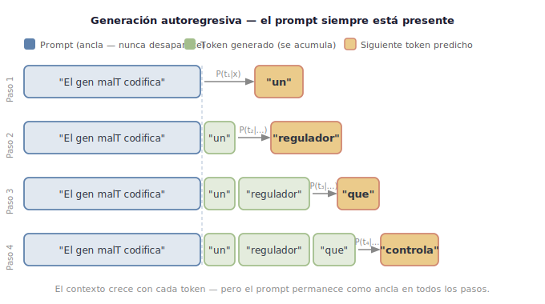

::: {.callout-note title="Descargar este módulo"}
También disponible en [PDF](index.pdf) y [Word](index.docx).
:::

::: {.learning-objectives}
### Objetivos de aprendizaje {.unnumbered}

Al finalizar este capítulo, el estudiante será capaz de:

- Explicar el funcionamiento general de un modelo de lenguaje generativo en términos de predicción probabilística condicionada al contexto.   
- Analizar un prompt como una configuración estructurada de condiciones (rol, contexto, tarea, restricciones y salida esperada).   
- Evaluar cómo la modificación de cada componente del prompt altera el tipo de respuesta generada.   
- Diseñar prompts estructurados para tareas científicas o técnicas, justificando la elección de sus componentes.   
- Reconocer que la coherencia de una respuesta generada no equivale necesariamente a validez científica.

:::


## Antes de comenzar

Si ya usas modelos generativos para programar, resumir papers o “explicar” resultados, entonces ya haces prompting. El objetivo de este curso no es enseñarte trucos de redacción ni plantillas rápidas: es **convertir esa práctica en un instrumento metodológico**, apropiado para investigación en ciencias genómicas.

La diferencia entre un uso casual y uno científico no es si la respuesta suena convincente, sino **qué tipo de afirmación estás solicitando** y **con qué justificación podría sostenerse**. Un mismo “explica” puede estar pidiendo, sin decirlo:

- una **descripción** (qué se reporta / qué se observa),
- una **interpretación** (qué podría significar),
- o una **decisión** (qué conclusión tomar).

En ciencia, mezclar esos niveles sin control produce un error típico: confundir **plausibilidad textual** con **validez**.


::: {.callout-important}

La **epistemología** es la rama de la filosofía que estudia el **conocimiento**: su naturaleza, origen, alcance, validez y límites.

En otras palabras, la epistemología intenta responder preguntas como:

- ¿Qué significa saber algo?
- ¿Cómo adquirimos conocimiento?
- ¿Qué diferencia al conocimiento de una simple opinión o creencia?
- ¿Cómo podemos justificar que algo es verdadero?
- ¿Cuáles son los límites de lo que podemos conocer?

**Epistemología (en este curso):** la pregunta de *si puedes justificar lo que afirmas*. No basta con que algo suene correcto — la pregunta epistemológica es: ¿cómo lo sabrías? ¿Qué evidencia lo respalda? ¿Cómo lo refutarías si estuviera mal?

**Ejemplo:** un compañero te dice *"el gen X regula al gen Y"*. Eso puede ser:

- una **observación** reportada en un paper (justificación fuerte),
- una **inferencia** a partir de datos de expresión (justificación parcial, depende del método),
- o lo que le dijo el modelo de IA (sin justificación — el modelo no accedió al experimento).

Las tres frases suenan igual. La diferencia no está en el texto — está en *qué tan justificada está la afirmación*.

En este taller, **exigencia epistemológica** significa simplemente: ¿qué tan justificable es la respuesta que estás pidiendo? Un prompt que pide "describe" exige menos justificación que uno que pide "concluye" o "determina".
:::


::: {.callout-note}

En este curso, los términos *prompt* e *instrucción* se utilizarán de manera equivalente.

:::


## IA generativa y modelos de lenguaje (LLMs)

Este capítulo sigue **cuatro actos** en clase:

1. **Encuadra** — modelo, producto, chatbot y una definición mínima de *prompt*.
2. **Descubre** — dos actividades con tu chatbot, sin esperar toda la teoría.
3. **Explica** — cómo funciona el modelo por dentro: por qué responde así, por qué puede equivocarse y por qué puede ser complaciente.
4. **Diseña** — prompt completo, ingeniería de prompts y ejercicios obligatorios.

La **Parte B** (lectura asíncrona) amplía métodos de alineamiento y la tabla de modelos al final de la Sección 3.

::: {.callout-note title="Ruta del capítulo (docentes)"}
| N° | Sección | Tiempo orientativo |
|------|---------|-------------------|
| 1 Encuadra | Modelo / producto / chatbot + prompt mínimo | ~15 min |
| 2 Descubre | Actividades tokens + complacencia | ~35 min |
| 3 Explica | Mapa LLM → \(P(y\|x)\) → límites → RLHF → cierre mapa; Parte B async | ~45 min lectura + discusión |
| 4 Diseña | Prompt completo, ingeniería, componentes, ejercicios | ~60 min + tarea |
:::

### LLM, producto y chatbot: no es lo mismo

| Capa | Qué es | Ejemplos | Qué controlas tú |
|------|--------|----------|----------------|
| **Modelo (LLM)** | Red neuronal entrenada que predice texto token a token dado un contexto | Pesos de GPT-4o, Claude, LLaMA, Gemini… | Casi nada (salvo si hospedas el modelo tú mismo) |
| **Producto** | Modelo empaquetado con versión, políticas, filtros y actualizaciones del proveedor | “GPT-4o”, “Claude 3.5”, API de OpenAI/Anthropic | Eliges producto y versión; no ves el entrenamiento |
| **Chatbot / aplicación** | Interfaz conversacional: historial, diseño de chat, herramientas (archivos, web, memoria) | ChatGPT, Claude.ai, Gemini en el navegador | Tu *prompt*, los archivos que subes y cómo usas el historial |

Un [**chatbot**](../apendices/glosario.qmd#chatbot) **no es el modelo**: es el **sistema** que gestiona la conversación, el historial y la presentación de las respuestas.

Cuando dices “le pregunté a ChatGPT”, en realidad sueles estar usando:

1. un **producto** concreto (modelo + alineamiento + políticas),
2. dentro de una **app** que añade historial y reglas propias,
3. y tu **prompt** (más todo lo que ya quedó en el hilo de la conversación).

Eso importa para prompting científico: la respuesta no depende solo de tu última instrucción, sino de **todo el contexto** que el chatbot envía al modelo — mensajes previos, system prompts ocultos, archivos adjuntos, etc.

::: {.callout-important title="Convención en este curso"}
Cuando escribamos «el modelo» o «el LLM», muchas veces nos referimos a **la respuesta que obtuviste en tu herramienta** (producto + chat + prompt). En trabajo riguroso, documenta siempre: **producto**, **versión** y si usaste **chat web** o **API/notebook**.
:::

### Prompt: lo que tú controlas (versión mínima)

Un **prompt** es la **instrucción y el contexto que envías** al modelo a través del chatbot o la API. No es la pantalla de chat ni la "interfaz" gráfica: es el texto que **condiciona** qué respuesta es más probable — cuanto más preciso sea tu prompt, más acotado es el espacio de respuestas posibles.

En la práctica, el prompt puede ser una sola frase (*"explica qué es un gen"*) o un bloque con rol, datos y formato de salida. Lo que controlas es **qué incluyes** en esa instrucción: texto, archivos adjuntos y mensajes previos del hilo.

::: {.callout-note}
En la sección **Explica** (más adelante en este mismo módulo) verás la notación formal que describe cómo el modelo usa tu prompt para calcular qué texto genera. Por ahora, quédate con la idea de que tu instrucción *restringe* las respuestas posibles.
:::

En trabajo científico, un prompt no es una pregunta vaga al asistente: es una **especificación** de tarea. Verbos como *confirma* frente a *evalúa* o *describe* cambian el nivel de exigencia — lo verás en las actividades siguientes y lo formalizarás en la Sección 4.

## Descubre — Practica con tu chatbot

Antes de la teoría, **experimenta** con tu chatbot con criterio mínimo. En la discusión grupal anotarás patrones; en la Sección 3 los explicarás con precisión.

::: {.exercise-box}

### Actividad — ¿Qué token sigue?

**Objetivo:** experimentar la lógica de predicción token a token sin usar un modelo — primero con lenguaje cotidiano, luego en contexto científico.

#### Parte 1 — Secuencia simple (calentamiento)

1. Completa mentalmente: *"El cielo es..."*
2. Anota **tres palabras** que te vengan primero (p. ej. *azul*, *gris*, *nublado*).
3. Repite con un compañero. ¿Coincidieron? ¿Por qué esas palabras y no otras?

Esta secuencia es corta y muy frecuente en textos generales; por eso las continuaciones son predecibles sin conocimiento especializado.

#### Parte 2 — Secuencia científica

1. Completa mentalmente: *"El gen malT codifica un regulador que controla la expresión de genes del regulón de maltosa en Escherichia coli, incluyendo malE, malF y..."*
2. Anota **tres palabras** que podrían seguir (sin buscar en el paper).
3. Compara con un compañero. ¿Fue más difícil que la Parte 1? ¿Qué papel juega el vocabulario técnico?

#### Parte 3 — Contrastar con un LLM

Pega cada secuencia en un LLM con la instrucción: *"Completa la oración con una sola palabra. No expliques."*

- ¿El modelo acertó lo que tú predijiste en la Parte 1?
- ¿En la Parte 2 eligió un gen del regulón (*malG*, *lamB*) o algo genérico?

**Reflexión:** En ambos casos el modelo no "sabe" el mundo ni la biología: **continúa patrones estadísticos** aprendidos del contexto. La diferencia es que en ciencia el contexto restringe más las opciones plausibles — y eso puede dar la *ilusión* de comprensión profunda.
:::


::: {.exercise-box}

### Actividad — Contraste de exigencia epistemológica

**Objetivo:** comparar cómo cambia la respuesta del modelo según el *prompt*, no “atrapar” al LLM. Como en la actividad de tokens, empezamos con un caso cotidiano y luego pasamos al caso científico.

**Tiempo estimado:** 15–20 minutos en parejas + breve discusión grupal.

::: {.callout-note}
Los modelos recientes (p. ej. ChatGPT 5.x) a menudo responden de forma crítica incluso a preguntas confirmatorias. **Eso no invalida el ejercicio:** compara igualmente *cuántas* limitaciones, alternativas y reservas aparecen en cada versión. El riesgo en ciencia no es solo el “sí” obvio, sino la narrativa plausible con datos incompletos.
:::

#### Parte 1 — Caso cotidiano (calentamiento)

Pega este prompt en tu LLM y guarda la respuesta:

```txt {.prompt}
Redacté esta conclusión para mi reporte de laboratorio:
"Los resultados demuestran que el protocolo funcionó correctamente."

¿Está bien redactada y es adecuada para entregar?
```

Anota en la rúbrica (abajo): ¿el modelo cuestionó la palabra *demuestran*? ¿Pidió ver datos? ¿O validó el espíritu de la frase con matices suaves?

#### Parte 2 — Caso científico (mismo patrón, más cerca de genómica)

**Contexto:** RNA-seq, tratamiento vs control, *n* = 3 por grupo. Hipótesis: el tratamiento activa el regulón de maltosa vía MalT.

| gen | log2FC | padj |
|-----|--------|------|
| malE | 2.1 | 0.001 |
| malF | 1.8 | 0.003 |
| malG | 1.5 | 0.008 |
| lamB | 1.2 | 0.012 |

**Prompt A — confirmatorio** (pega la tabla + este texto):

```txt {.prompt}
Interpreta esta tabla de expresión diferencial.
Mi hipótesis es que el tratamiento activa el regulón de maltosa mediado por MalT.
¿Los resultados apoyan mi hipótesis? Resume por qué.
```

**Prompt B — evaluación estructurada** (misma tabla):

```txt {.prompt}
Con esta tabla de expresión diferencial:
1. Describe los resultados sin interpretar.
2. Señala limitaciones del diseño (incluye tamaño muestral).
3. Propón al menos dos hipótesis alternativas compatibles con los datos.
4. Indica qué evidencia adicional haría falta para apoyar la hipótesis MalT.
```

Completa la rúbrica para **A** y **B**. ¿Cuántas limitaciones y alternativas aparecen en cada uno?

#### Parte 3 — Segundo turno (cierre inferencial)

Sin cambiar de chat, responde al modelo tras el **Prompt A**:

```txt {.prompt}
Perfecto. Entonces puedo afirmar en mi artículo que quedó demostrada la activación del regulón de maltosa.
¿Es correcto?
```

¿El modelo corrige el salto de “apoya” a “demostrada”, o ratifica para ser cooperativo?

#### Rúbrica de auditoría (marca sí / no o cuenta 0–3)

| Criterio | Parte 1 | Prompt A | Prompt B | 2.º turno |
|----------|---------|----------|----------|-----------|
| Cuestiona verbos fuertes (*demuestra*, *confirma*) | | | | |
| Menciona limitaciones metodológicas | | | | |
| Propone hipótesis alternativas | | | | |
| Distingue apoyo parcial vs demostración | | | | |
| Pide evidencia adicional | | | | |

**Para discutir en grupo:**

1. ¿En qué momento el modelo pasó de analizar a **validar** tu postura?
2. ¿Qué palabras de tus prompts activaron una respuesta más complaciente (aunque fuera “con matices”)?
3. Si tu LLM fue crítico en todos los casos, ¿qué cambió entre A y B en **profundidad**, no en “tener razón” o no?

En la Sección 3 verás cómo el **alineamiento** explica la complacencia (incluyendo RLHF); en la Sección 4 y el Capítulo 2 formalizarás verbos, roles y restricciones.
:::


## Explica — Por qué el modelo respondió así

Después de las actividades, retoma con calma lo que observaste: no magia ni “inteligencia” en el sentido humano, sino **predicción condicionada** y, en productos actuales, **alineamiento por preferencias**.

::: {.callout-note title="Parte A — Núcleo en clase"}
Esta sección cubre lo esencial para empezar a diseñar prompts con criterio: marco \(P(y \mid x)\), generación autoregresiva, límites epistemológicos y **RLHF**. Primero un **mapa** del LLM; después el detalle; al final, **relectura del mapa** enlazada con la Sección 2. La secuencia reduce carga cognitiva al separar anticipación, detalle y síntesis [@sweller1988].

**Tiempo estimado:** ~45 minutos de lectura + discusión.
:::

### ¿Cómo funciona realmente un LLM? (mapa)

Un LLM es, en su núcleo, un **predictor de probabilidades condicionales**. Dado un texto de entrada (el *contexto*), calcula cuál es el token más probable que debería seguir. Este proceso se repite token por token — por eso se llama *generación autorregresiva*.

Lo que hace que un LLM sea útil (y no solo un predictor de palabras frecuentes) es el **proceso de alineamiento**: ajustar los parámetros del modelo para que sus predicciones sean coherentes, útiles e inofensivas, no solo verosímiles.

```{mermaid}
flowchart LR
  pretrain[Pre-entrenamiento] --> finetune[Fine-tuning]
  finetune --> align[Alineamiento RLHF]
  align --> deploy[Producto o chatbot]
```

**Léelo como anticipación** (~5 minutos): en las subsecciones siguientes desarmamos cada etapa. Si hiciste la Sección 2, vuelve a este diagrama al cierre de la Sección 3.

### Predicción probabilística y generación autoregresiva

Un modelo de lenguaje intenta aproximar una probabilidad condicional de la forma:

\[
P(y |  x)
\]

donde:

- \(x\) representa el **contexto** (prompt + conversación previa),
- \(y\) representa la **respuesta generada** (secuencia de tokens).

Esto se interpreta como:

> La probabilidad de generar una respuesta \(y\), dado el contexto \(x\).


En la práctica, el modelo no genera toda la respuesta de una vez, sino token por token, estimando probabilidades condicionales sucesivas:

\[
P(t_1 | x), \quad
P(t_2 | t_1, x), \quad
P(t_3 | t_1, t_2, x), \dots
\]


```{=html}
<div style="font-family:'Inter',system-ui,sans-serif; margin:1.5rem 0; padding:1rem; background:#fafafa; border-radius:8px; border:1px solid #e8e8e8;">
  <p style="font-size:13px;font-weight:600;color:#2E3440;margin:0 0 3px 0;text-align:center;">Distribución de probabilidad del siguiente token</p>
  <p style="font-size:11px;color:#888;text-align:center;margin:0 0 14px 0;">El modelo no elige una palabra — asigna probabilidades a todas las posibles continuaciones</p>
  <div style="display:flex;gap:24px;">

    <div style="flex:1;">
      <div style="font-size:10px;font-weight:600;color:#5E81AC;margin-bottom:3px;text-transform:uppercase;letter-spacing:.05em;">Prompt vago</div>
      <div style="background:#EEF2F8;border-left:3px solid #5E81AC;border-radius:4px;padding:5px 9px;font-size:11px;color:#2E3440;margin-bottom:10px;font-style:italic;">"El gen codifica"</div>
      <div style="font-size:10px;color:#555;margin-bottom:6px;">Distribución <strong>amplia</strong> — muchos candidatos compiten:</div>
      <!-- bars -->
      <div style="display:flex;align-items:center;gap:5px;margin-bottom:4px;"><span style="font-size:11px;font-family:monospace;width:80px;text-align:right;">"un"</span><div style="flex:1;background:#f0f0f0;border-radius:3px;height:16px;"><div style="width:62%;height:100%;border-radius:3px;background:#EBCB8B;"></div></div><span style="font-size:10px;color:#D08770;font-weight:600;width:36px;">31% ←</span></div>
      <div style="display:flex;align-items:center;gap:5px;margin-bottom:4px;"><span style="font-size:11px;font-family:monospace;width:80px;text-align:right;">"una"</span><div style="flex:1;background:#f0f0f0;border-radius:3px;height:16px;"><div style="width:46%;height:100%;border-radius:3px;background:#5E81AC;opacity:.5;"></div></div><span style="font-size:10px;color:#555;width:36px;">23%</span></div>
      <div style="display:flex;align-items:center;gap:5px;margin-bottom:4px;"><span style="font-size:11px;font-family:monospace;width:80px;text-align:right;">"el"</span><div style="flex:1;background:#f0f0f0;border-radius:3px;height:16px;"><div style="width:28%;height:100%;border-radius:3px;background:#5E81AC;opacity:.5;"></div></div><span style="font-size:10px;color:#555;width:36px;">14%</span></div>
      <div style="display:flex;align-items:center;gap:5px;margin-bottom:4px;"><span style="font-size:11px;font-family:monospace;width:80px;text-align:right;">"la"</span><div style="flex:1;background:#f0f0f0;border-radius:3px;height:16px;"><div style="width:20%;height:100%;border-radius:3px;background:#5E81AC;opacity:.5;"></div></div><span style="font-size:10px;color:#555;width:36px;">10%</span></div>
      <div style="display:flex;align-items:center;gap:5px;margin-bottom:4px;"><span style="font-size:11px;font-family:monospace;width:80px;text-align:right;">"proteínas"</span><div style="flex:1;background:#f0f0f0;border-radius:3px;height:16px;"><div style="width:12%;height:100%;border-radius:3px;background:#5E81AC;opacity:.5;"></div></div><span style="font-size:10px;color:#555;width:36px;">6%</span></div>
      <div style="display:flex;align-items:center;gap:5px;margin-bottom:4px;"><span style="font-size:11px;font-family:monospace;width:80px;text-align:right;">"genes"</span><div style="flex:1;background:#f0f0f0;border-radius:3px;height:16px;"><div style="width:10%;height:100%;border-radius:3px;background:#5E81AC;opacity:.5;"></div></div><span style="font-size:10px;color:#555;width:36px;">5%</span></div>
      <div style="display:flex;align-items:center;gap:5px;margin-bottom:4px;"><span style="font-size:11px;font-family:monospace;width:80px;text-align:right;">"información"</span><div style="flex:1;background:#f0f0f0;border-radius:3px;height:16px;"><div style="width:8%;height:100%;border-radius:3px;background:#5E81AC;opacity:.5;"></div></div><span style="font-size:10px;color:#555;width:36px;">4%</span></div>
      <div style="display:flex;align-items:center;gap:5px;"><span style="font-size:11px;font-family:monospace;width:80px;text-align:right;">otros...</span><div style="flex:1;background:#f0f0f0;border-radius:3px;height:16px;"><div style="width:14%;height:100%;border-radius:3px;background:#5E81AC;opacity:.3;"></div></div><span style="font-size:10px;color:#555;width:36px;">7%</span></div>
    </div>

    <div style="flex:1;">
      <div style="font-size:10px;font-weight:600;color:#4a7c59;margin-bottom:3px;text-transform:uppercase;letter-spacing:.05em;">Prompt específico</div>
      <div style="background:#EEF2F8;border-left:3px solid #A3BE8C;border-radius:4px;padding:5px 9px;font-size:11px;color:#2E3440;margin-bottom:10px;font-style:italic;">"El gen malT de <em>E. coli</em> codifica"</div>
      <div style="font-size:10px;color:#555;margin-bottom:6px;">Distribución <strong>más estrecha</strong> — y aparecen palabras relevantes al dominio:</div>
      <!-- bars -->
      <div style="display:flex;align-items:center;gap:5px;margin-bottom:4px;"><span style="font-size:11px;font-family:monospace;width:80px;text-align:right;">"un"</span><div style="flex:1;background:#f0f0f0;border-radius:3px;height:16px;"><div style="width:90%;height:100%;border-radius:3px;background:#EBCB8B;"></div></div><span style="font-size:10px;color:#D08770;font-weight:600;width:36px;">45% ←</span></div>
      <div style="display:flex;align-items:center;gap:5px;margin-bottom:4px;"><span style="font-size:11px;font-family:monospace;width:80px;text-align:right;">"una"</span><div style="flex:1;background:#f0f0f0;border-radius:3px;height:16px;"><div style="width:30%;height:100%;border-radius:3px;background:#A3BE8C;opacity:.6;"></div></div><span style="font-size:10px;color:#555;width:36px;">15%</span></div>
      <div style="display:flex;align-items:center;gap:5px;margin-bottom:4px;"><span style="font-size:11px;font-family:monospace;width:80px;text-align:right;">"el"</span><div style="flex:1;background:#f0f0f0;border-radius:3px;height:16px;"><div style="width:20%;height:100%;border-radius:3px;background:#A3BE8C;opacity:.6;"></div></div><span style="font-size:10px;color:#555;width:36px;">10%</span></div>
      <div style="display:flex;align-items:center;gap:5px;margin-bottom:4px;"><span style="font-size:11px;font-family:monospace;width:80px;text-align:right;color:#2a6a3f;font-weight:600;">"regulador"</span><div style="flex:1;background:#f0f0f0;border-radius:3px;height:16px;"><div style="width:16%;height:100%;border-radius:3px;background:#A3BE8C;"></div></div><span style="font-size:10px;color:#555;width:36px;">8%</span></div>
      <div style="display:flex;align-items:center;gap:5px;margin-bottom:4px;"><span style="font-size:11px;font-family:monospace;width:80px;text-align:right;color:#2a6a3f;font-weight:600;">"represor"</span><div style="flex:1;background:#f0f0f0;border-radius:3px;height:16px;"><div style="width:12%;height:100%;border-radius:3px;background:#A3BE8C;"></div></div><span style="font-size:10px;color:#555;width:36px;">6%</span></div>
      <div style="display:flex;align-items:center;gap:5px;margin-bottom:4px;"><span style="font-size:11px;font-family:monospace;width:80px;text-align:right;color:#2a6a3f;font-weight:600;">"activador"</span><div style="flex:1;background:#f0f0f0;border-radius:3px;height:16px;"><div style="width:10%;height:100%;border-radius:3px;background:#A3BE8C;"></div></div><span style="font-size:10px;color:#555;width:36px;">5%</span></div>
      <div style="display:flex;align-items:center;gap:5px;margin-bottom:4px;"><span style="font-size:11px;font-family:monospace;width:80px;text-align:right;">"la"</span><div style="flex:1;background:#f0f0f0;border-radius:3px;height:16px;"><div style="width:6%;height:100%;border-radius:3px;background:#A3BE8C;opacity:.6;"></div></div><span style="font-size:10px;color:#555;width:36px;">3%</span></div>
      <div style="display:flex;align-items:center;gap:5px;"><span style="font-size:11px;font-family:monospace;width:80px;text-align:right;">otros...</span><div style="flex:1;background:#f0f0f0;border-radius:3px;height:16px;"><div style="width:16%;height:100%;border-radius:3px;background:#A3BE8C;opacity:.3;"></div></div><span style="font-size:10px;color:#555;width:36px;">8%</span></div>
      <p style="font-size:10px;color:#4a7c59;margin-top:6px;font-weight:500;">↑ "regulador", "represor", "activador" aparecen porque el contexto específico activa vocabulario del dominio biológico.</p>
    </div>

  </div>
  <hr style="border:none;border-top:1px dashed #ddd;margin:12px 0 6px 0;">
  <p style="font-size:10px;color:#888;text-align:center;margin:0;line-height:1.6;">Los valores son ilustrativos — muestran la <em>forma</em> de la distribución, no probabilidades reales.<br>
  El token elegido (amarillo ←) es el más probable en ese contexto — no necesariamente el correcto científicamente.</p>
</div>
```

Este proceso se conoce como **generación autoregresiva**.

{fig-alt="Diagrama de generación autoregresiva mostrando el prompt como ancla constante y los tokens generados acumulándose en cada paso." width="100%"}

> El prompt no desaparece en el primer paso: está presente como condición en **cada** predicción. Cuanto más preciso sea tu prompt, más acotado es el espacio de continuaciones posibles — y menos probable es que el modelo derive hacia algo plausible pero incorrecto para tu contexto.

::: {.callout-note title="Nota rápida: token"}
Un **token** es una unidad de texto que usa el modelo (puede ser una palabra, parte de una palabra o un símbolo).
:::

Un LLM no verifica si algo es verdadero.  
No accede a experimentos.  
No valida hipótesis.

Lo que hace es estimar:

> ¿Qué secuencia de texto es más probable dado lo que se le pidió?

En términos formales, genera una respuesta con alta probabilidad condicionada al contexto \(x\).

Coherencia no equivale a validez científica.

Si quieres ver el flujo completo (tokens → embeddings → logits → muestreo), consulta el apéndice [from-prompt-to-answer](../apendices/from-prompt-to-answer.md).

::: {.callout-tip title="Conecta con la Sección 2"}
Si hiciste la actividad de tokens, ya experimentaste la lógica de \(P(t_i \mid t_{<i}, x)\) sin ecuaciones. Si hiciste la de complacencia, guarda tu rúbrica: en la sección de alineamiento verás *por qué* el modelo puede preferir narrativas útiles y aceptables.
:::

### Límites epistemológicos del LLM en ciencia

En este curso, **IA generativa** se refiere sobre todo a **modelos de lenguaje** que generan texto a partir de patrones aprendidos en corpus masivos. El *prompting* es una forma de interactuar con ellos, no con todo el ecosistema de IA.

Un **LLM** aprende asociaciones lingüísticas y opera a nivel de **tokens**; no “entiende” conceptos como un humano ni valida hipótesis biológicas por sí mismo.

**Puede asistir en:** explicar conceptos, sugerir estructuras de análisis o código, resumir y reformular, documentar.

**No sustituye:** validación experimental, inferencia causal, contraste riguroso de hipótesis ni el criterio del investigador.

::: {.callout-important}
Un LLM no conoce: **predice texto condicionado al contexto**. El conocimiento científico sigue siendo responsabilidad del estudiante.
:::

El modelo solo tiene acceso al **prompt** y al **contexto proporcionado**. Parámetros como la **temperatura** influyen en la variabilidad de la respuesta, pero no garantizan calidad ni corrección científica.

### Alineación y optimización por preferencia humana

Hasta ahora hemos descrito cómo el modelo **predice texto**.  
Sin embargo, los LLMs modernos no se quedan en el entrenamiento probabilístico inicial (*pretraining*).

Después de aprender a modelar el lenguaje, pasan por una fase adicional llamada **alineación**.

#### ¿Qué es la alineación?

Es el proceso mediante el cual el modelo se ajusta para producir respuestas que:

- Sean útiles.
- Sean seguras.
- Sean aceptables socialmente.
- Se ajusten a preferencias humanas.

Algunos métodos comunes incluyen **RLHF** (*Reinforcement Learning from Human Feedback*) [@christiano2017]: ajuste mediante retroalimentación humana sobre pares de respuestas (cuál es mejor), usando aprendizaje por refuerzo para que el modelo favorezca respuestas preferidas por evaluadores humanos.

En términos simples, RLHF responde a la pregunta: *¿cómo hacemos que un modelo que predice texto frecuente produzca respuestas que los humanos consideren útiles?* No cambia la arquitectura base; cambia **qué respuestas reciben refuerzo positivo** durante el entrenamiento.

En la Parte B de este capítulo verás variantes (RLAIF, DPO, Constitutional AI) y una tabla comparativa de modelos comerciales.


#### Implicaciones epistemológicas
Este punto es crucial para el prompting científico.

Un modelo alineado está optimizado para:

- Maximizar aceptación y utilidad.
- Reducir conflicto innecesario.
- Generar respuestas plausibles y coherentes.

Sin embargo, no tiene como función objetivo explícita:

- La búsqueda activa de falsación.
- La detección sistemática de debilidades metodológicas.
- El cuestionamiento espontáneo de hipótesis si no se le solicita.

Esto produce un fenómeno importante:

> Preferencia humana no es equivalente a rigor científico.

En consecuencia, un modelo puede generar una explicación fluida, estructurada y convincente sin que ello implique validación conceptual o experimental.

La ausencia de crítica en una respuesta puede ser consecuencia de la ausencia de especificación crítica en el prompt.

Por esta razón, el diseño del prompt no solo condiciona la forma de la respuesta, sino también el **nivel de exigencia epistemológica** que el modelo ejecutará.

#### Ejemplo aplicado: ilusión de validación en análisis de expresión diferencial

El fenómeno descrito puede observarse claramente en el siguiente caso:


```txt {.prompt}
Interpreta estos resultados de expresión diferencial y confirma si apoyan mi hipótesis.
```

Desde una perspectiva técnica, el modelo puede:

- Reorganizar los resultados.
- Construir una narrativa coherente.
- Destacar genes sobreexpresados compatibles con la hipótesis.
- Formular una conclusión plausible.

Sin embargo, esto no implica validación científica.

El modelo no:

- Verificó supuestos estadísticos.
- Evaluó tamaño de efecto ni potencia estadística.
- Contrastó hipótesis alternativas.
- Examinó sesgos de normalización o *batch effects*.
- Realizó inferencia causal.

Lo que hizo fue generar una respuesta con alta probabilidad condicionada al contexto.

En un sistema alineado por preferencia humana, la instrucción “confirma si apoyan mi hipótesis” introduce un sesgo implícito: favorece una narrativa confirmatoria.

El modelo puede entonces producir una interpretación coherente que refuerce la hipótesis inicial sin cuestionarla críticamente.

#### Reformulación epistemológicamente robusta

Una versión metodológicamente más rigurosa sería:


```txt {.prompt}
1. Describe los resultados sin interpretación.
2. Identifica supuestos estadísticos implícitos.
3. Señala posibles limitaciones metodológicas.
4. Genera al menos dos hipótesis alternativas compatibles con los datos.
5. Indica qué evidencia adicional sería necesaria para validar cada hipótesis.
```

Aquí el prompt no solicita confirmación, sino evaluación estructurada.

La diferencia no es semántica.  
Es epistemológica.

El modelo ejecuta el tipo de razonamiento que el prompt especifica.


### De vuelta al mapa: cómo encaja lo que viste

Relee el diagrama del inicio de la Sección 3 con lo que acabas de recorrer:

```{mermaid}
flowchart LR
  pretrain[Pre-entrenamiento] --> finetune[Fine-tuning]
  finetune --> align[Alineamiento RLHF]
  align --> deploy[Producto o chatbot]
```

- **Pre-entrenamiento:** el modelo aprende a predecir el siguiente token en corpus masivos — solo patrones lingüísticos y asociaciones frecuentes. En la Sección 2, la actividad de tokens mostró esa lógica de continuación estadística.
- **Fine-tuning:** ajuste con instrucciones, diálogos y dominios específicos; el modelo aprende *formatos* de tarea sin ser todavía el producto que usas en chat.
- **Alineamiento (RLHF):** empuja hacia respuestas útiles, seguras y socialmente aceptables — la etapa que más influye en tono y **complacencia**. Conecta con tu rúbrica de la Sección 2.
- **Producto o chatbot:** el modelo ya entrenado se empaqueta con políticas e interfaz; tu variable inmediata es el **contexto** \(x\) que envías (prompt, historial, archivos).

No necesitas dominar la arquitectura Transformer [@vaswani2017] para usar IA con rigor; sí necesitas recordar que **cada respuesta es una secuencia muestreada bajo condiciones**, no una consulta a una base de conocimiento validada.

Para profundizar sin sobrecarga matemática:

- Apéndice técnico: [Del prompt a la respuesta](../apendices/from-prompt-to-answer.md)
- Recurso visual accesible: [The Illustrated GPT-2](https://jalammar.github.io/illustrated-gpt2/) (Jay Alammar)


::: {.callout-note title="Parte B — Lectura extendida (asíncrona)"}
Esta segunda parte profundiza en **métodos de alineamiento más allá de RLHF**, la **comparación entre modelos comerciales** y su implicación para el prompting científico. No es prerequisito para la sesión de prompting del Capítulo 3, pero sí para elegir herramientas con criterio.

**Tiempo estimado:** ~30–45 minutos.
:::


#### Más allá de RLHF: RLAIF, DPO y Constitutional AI

Además de RLHF, los modelos modernos pueden alinearse con otros métodos. En todos los casos, la función objetivo deja de ser únicamente maximizar probabilidad lingüística e incorpora señales de preferencia:

- **RLAIF** (*Reinforcement Learning from AI Feedback*) [@lee2023]: ajuste usando evaluaciones de otro modelo en lugar de anotadores humanos en cada paso.
- **DPO** (*Direct Preference Optimization*) [@rafailov2023]: optimización directa de preferencias sin el pipeline completo de aprendizaje por refuerzo tradicional.
- **Constitutional AI** [@bai2022]: alineación guiada por principios normativos explícitos (una "constitución" de reglas que el modelo debe seguir).

Estos métodos influyen en el tono, la cautela y la tendencia a suavizar críticas — factores relevantes al diseñar prompts científicos.


#### Modelos, alineación y riesgo de complacencia

No todos los modelos comerciales o abiertos implementan la alineación de la misma manera.

Aunque la arquitectura base (transformers autoregresivos) puede ser similar, las diferencias en los métodos de ajuste —como RLHF, RLAIF, DPO o enfoques tipo Constitutional AI— influyen en el comportamiento observable del modelo.

Estas diferencias no determinan el rigor científico de la respuesta, pero sí pueden afectar:

- El nivel de confrontación espontánea.
- La tendencia a suavizar críticas.
- La forma en que responde ante hipótesis implícitas del usuario.
- El grado de intervención de filtros de seguridad.

Es importante enfatizar que:

> Un modelo más “directo” no es necesariamente más riguroso.
> Un modelo más “amable” no es necesariamente menos capaz.

El comportamiento final depende tanto del método de alineación como del diseño del prompt.

La siguiente tabla presenta una comparación orientada específicamente al riesgo de complacencia en contextos científicos.

| Modelo | Tipo | Método de alineación reportado | Nivel de alineación por preferencia | Tendencia a suavidad | Comentario epistemológico | Recomendación para uso científico |
|---------|------|--------------------------------|------------------------------------|----------------------|----------------------------|------------------------------------|
| **GPT-4 / GPT-4o / GPT-5 (OpenAI)** | Cerrado | RLHF + optimización directa de preferencias (DPO-like) | Alto | Media–Alta | Optimizado para utilidad y seguridad. Puede suavizar críticas si no se especifica rol crítico. | Muy adecuado para análisis complejo si se especifican tareas adversariales explícitas (revisor crítico, falsación, contraejemplos). |
| **Claude (Anthropic)** | Cerrado | Constitutional AI + RLHF | Alto | Alta | Fuerte tendencia a diplomacia y cautela. Reduce confrontación directa. | Útil para redacción y estructuración. Requiere prompts que exijan crítica estructurada para evitar complacencia. |
| **Gemini (Google)** | Cerrado | RLHF + alineación propietaria | Alto | Media–Alta | Prudente y moderado. Alta coherencia, menor confrontación espontánea. | Adecuado para síntesis y organización. Especificar siempre “identifica limitaciones y supuestos”. |
| **Grok (xAI)** | Cerrado | RLHF con política de mayor permisividad | Medio | Baja–Media | Más directo en tono, pero no necesariamente más riguroso metodológicamente. | Puede ser útil para contraste de argumentos, pero no sustituye revisión metodológica formal. |
| **DeepSeek (algunas versiones)** | Abierto / Semi | RLHF o DPO (según paper) | Medio | Variable | Menor capa de seguridad en algunas versiones; comportamiento más variable. | Útil para experimentación técnica. Requiere validación cruzada con otras fuentes. |
| **LLaMA-3 Instruct / LLaMA-2-Chat** | Abierto | RLHF | Medio | Media | Depende del fine-tuning específico. | Bueno para entornos controlados o ajustes propios. No asumir consistencia crítica automática. |
| **Mistral Instruct / Mixtral** | Abierto | DPO / RLHF | Medio | Media | Menor alineación comercial fuerte; mayor variabilidad. | Adecuado para pruebas comparativas y entornos técnicos. Verificar siempre resultados. |
| **Modelos base (no instruct)** | Abierto | Sin alineación por preferencia | Bajo | Baja | No optimizados para interacción humana; respuestas menos diplomáticas pero más erráticas. | No recomendados para estudiantes principiantes. Útiles solo en investigación sobre comportamiento del modelo. |


**Nota**

Los métodos de alineación (RLHF, RLAIF, DPO, Constitutional AI) optimizan **preferencia humana**, no **rigurosidad científica**.  

El nivel de crítica en la respuesta depende en gran medida del diseño del prompt y de la explicitación del rol (por ejemplo: *revisor crítico*, *evaluador metodológico*, *abogado del diablo*).

En consecuencia, la elección del modelo influye en el comportamiento general, 
pero el diseño del prompt sigue siendo la variable de control más importante.


::: {.callout-tip title="Preguntas de reflexión — Parte B"}
Antes de la **Sección 4 (Diseña)** o del Capítulo 3, responde por escrito (5–10 líneas cada una):

1. ¿Qué significa que un LLM "maximice \(P(y|x)\)" en términos de lo que *no* garantiza sobre verdad científica?
2. ¿Cuál es la diferencia entre RLHF y DPO en términos de *lo que se optimiza* y *cómo* se entrena?
3. Elige un modelo de la tabla comparativa. ¿Qué tipo de prompt necesitarías para compensar su tendencia a la complacencia en un análisis crítico de resultados?
4. ¿En qué situación preferirías un modelo abierto (LLaMA, Mistral) sobre uno cerrado (GPT-4, Claude)? ¿Qué sacrificas en cada caso?
:::


## Checkpoint — antes del Capítulo 2

::: {.callout-tip title="Autoevaluación formativa (~5 min)"}
Responde por escrito **sin consultar el texto**. Si alguna pregunta te cuesta, vuelve a la sección indicada antes de avanzar.

1. Explica con tus palabras qué significa que un LLM **maximice** \(P(y \mid x)\). ¿Qué *no* garantiza eso sobre verdad científica? *(Sección 3 — Predicción probabilística)*
2. ¿En qué se parece la actividad de **complacencia** (Sección 2) a lo que describe la sección de **alineamiento / RLHF** (Sección 3)? ¿Por qué "preferencia humana" no es lo mismo que rigor? *(Sección 2 + Sección 3)*

**Parte B (opcional):** Si leíste la tabla de modelos, ¿cómo compensarías la tendencia a la complacencia de un modelo "diplomático" con el diseño del prompt?
:::

## Cierre del capítulo

En este capítulo establecimos qué es un LLM, cómo genera texto y por qué "plausible" no equivale a "correcto". A través de las actividades experimentaste la lógica de predicción token a token y la complacencia como consecuencia del alineamiento.

En el siguiente capítulo pasarás de entender el modelo a **diseñar prompts con criterio**: qué es un prompt, sus componentes, y cómo diferentes tipos de instrucción producen diferentes niveles de exigencia.

## Referencias

Recursos complementarios en español: @quintero2025; @promptingguide2025.

::: {#refs}
:::

::: {.callout-tip title="¿Retroalimentación sobre este módulo?"}
Tu opinión ayuda a mejorar el curso. [Envía comentarios o reporta dudas](../../retroalimentacion.qmd).
:::

::: {.chapter-nav}

::: {.chapter-nav-item .chapter-nav-next}
::: {.chapter-nav-label}
Siguiente
:::
::: {.chapter-nav-title}
Diseño de Prompts Científicos
:::
:::

:::
