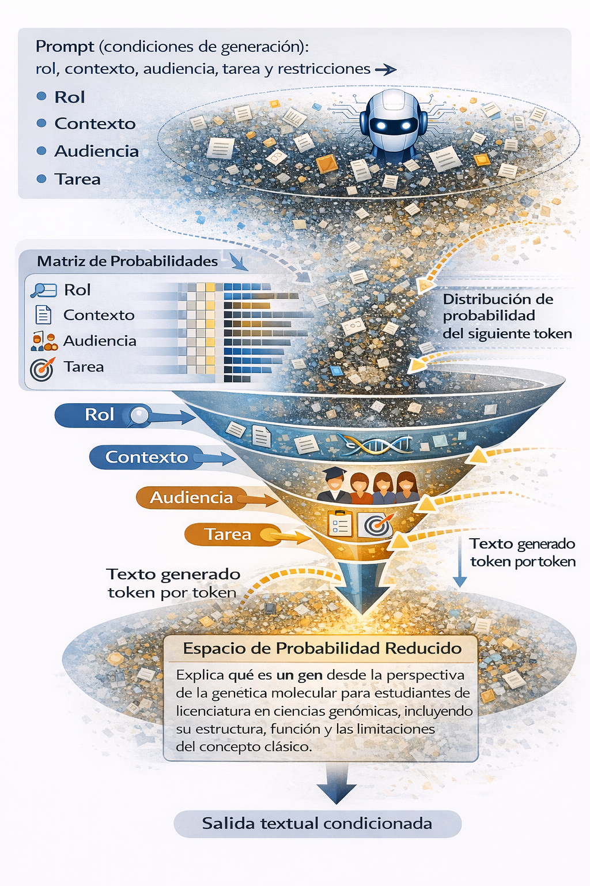

::: {.callout-note title="Descargar este módulo"}
También disponible en [PDF](index.pdf) y [Word](index.docx).
:::

## Antes de comenzar

En el Capítulo 1 comprendiste cómo funciona el modelo por dentro: predice texto token a token condicionado por el prompt, con un comportamiento moldeado por el alineamiento. La pregunta que quedó abierta es: **¿cómo se traduce ese entendimiento en una instrucción bien construida?**

En este capítulo la pregunta cambia: ¿qué hace que un prompt sea científicamente usable — no solo fluido o convincente? Aquí fijamos la definición del prompt, la ingeniería de prompts y los cinco componentes base; el Capítulo 3 añade Alcance y Verificación, y el Capítulo 4 extiende el protocolo multi-fase.

## ¿Qué es un prompt?

Un *prompt* es la **instrucción (y el contexto) que condiciona la generación**: expresa intención, define la tarea y fija, explícita o implícitamente, las condiciones bajo las cuales espera una respuesta del modelo.
Esta lógica es análoga a la especificación de un problema computacional.

Los sistemas de IA no comprenden objetivos ni contextos por sí mismos. 
No verifican empíricamente si una afirmación es correcta, ni evalúan por sí mismos la relevancia científica del contenido generado.

Por esta razón, la estructura del prompt condiciona el espacio de respuestas posibles y el tipo de afirmación que el modelo puede producir.

En contexto científico, un prompt no es una pregunta abierta: es una especificación operativa de una tarea, cuyos términos delimitan qué tipo de inferencia será producida y qué tan evaluable resultará la salida.

> * Una instrucción vaga genera una respuesta vaga.
> * Una instrucción ambigua genera una respuesta ambigua.
> * Una instrucción mal definida puede generar una respuesta convincente, pero incorrecta.

::: {.callout-important title="El modelo no sabe lo que tú no sabes"}
El LLM genera texto plausible dado tu instrucción. «Plausible» significa que se ve correcto según los patrones del lenguaje con el que fue entrenado — no que sea correcto en tu contexto específico.

Un experto en el dominio puede detectar esa diferencia: sabe qué restringir porque conoce qué puede salir mal, y puede evaluar la salida porque tiene criterios externos reales. Un novato acepta lo plausible como correcto — y no hay señal de error porque el texto está bien redactado, el código corre sin errores, la tabla tiene el formato esperado.

**Tus prompts solo pueden ser tan buenos como tu conocimiento del dominio lo permita.**

---

**Ejemplo cotidiano — receta de pan**

*Novato:* «Dame una receta para hacer pan en casa.»
El modelo entrega una receta con pasos bien redactados. Si no sabes panadería, aceptas los tiempos y temperaturas sin poder evaluar si son correctos para tu horno, tu harina o la humedad del ambiente.

*Experto (panadero):* «Receta de pan de masa madre con harina integral al 30%, hidratación 75%, fermentación en frío a 4 °C por 12 horas. Sin levadura comercial ni aditivos. Verificación: indica cómo reconocer si la fermentación fue insuficiente antes de hornear.»
El experto sabe qué parámetros controlan el resultado y tiene criterios para detectar el error antes de que arruine el pan.

---

**Ejemplo científico — análisis de RNA-seq**

*Novato:* «Analiza este conjunto de datos de RNA-seq y dime qué genes cambian entre las dos condiciones.»
El modelo produce una tabla de genes con formato impecable. Sin conocimiento del dominio, no hay forma de saber si el método estadístico es apropiado, si los umbrales son correctos, ni si la interpretación es válida.

*Experto:* «Conteos crudos de RNA-seq, 3 réplicas por condición, *E. coli*. Usa DESeq2, umbral log2FC > 1 y padj < 0.05. No concluyas causalidad regulatoria. Reporta genes up- y down-regulated por separado. Verificación: incluye MA-plot para detectar sesgos de normalización.»
Solo el experto puede escribir esto: sabe qué método aplica, distingue expresión diferencial de regulación causal, y conoce el control de calidad necesario antes de interpretar.

---

La diferencia no está en el «arte de formular» — está en el conocimiento del dominio que permite saber qué restringir y cómo verificar. A lo largo del taller aprenderás a hacer explícito ese conocimiento en cada componente del prompt.
:::


Considera este ejemplo. El siguiente prompt es válido sintácticamente, pero incompleto:

```txt {.prompt}
Explica qué es un gen.
```


Este prompt indica una tarea (*explicar*), pero **no define** el nivel académico, el marco  ni el propósito de la explicación. Como resultado, el sistema tenderá a generar una respuesta general y poco específica.


**Prompt contextualizado en genética:**  

```txt {.prompt}
Explica qué es un gen desde la perspectiva de la genética molecular, para una audiencia con formación en biología, incluyendo su estructura, función y las limitaciones del concepto clásico.
```


En este caso, el prompt:

- delimita el **dominio científico**,
- define la **audiencia**,
- y acota el **alcance conceptual**.

La IA no “comprende” mejor el tema, pero **opera bajo restricciones más claras**, lo que incrementa la calidad epistemológica de la respuesta.

{width="60%"}

Los modelos de lenguaje generan texto de forma [autoregresiva](../apendices/from-prompt-to-answer.md), estimando en cada paso la **distribución de probabilidad del siguiente token**. El *prompt* introduce condiciones de generación (rol, contexto, audiencia y tarea) que restringen el espacio probabilístico del modelo, reduciendo los grados de libertad y dando lugar a una **salida textual condicionada** y más específica.

La **ingeniería de prompts** es el conjunto de principios y prácticas para diseñar, evaluar y refinar esas instrucciones de forma controlada. Una idea central de este curso es que el *prompting* no consiste en “preguntar mejor”, sino en **diseñar instrucciones**: tomar decisiones conscientes sobre qué información se proporciona, qué se espera como resultado, qué límites existen y cómo se evaluará la respuesta. Desde esta perspectiva, un prompt se asemeja más a un **protocolo** o un **instructivo técnico** que a una pregunta informal.


## Componentes de un prompt como variables de control

Un prompt no es solo una instrucción escrita: es una configuración de condiciones iniciales que delimitan el espacio de respuestas posibles.

Cada componente introduce una restricción operativa que reduce ambigüedad y acota el rango de interpretaciones posibles. En conjunto, determinan:

- qué información puede utilizar el modelo,
- qué tipo de tarea debe ejecutar,
- bajo qué supuestos y límites explícitos debe operar,
- y en qué formato será evaluable la respuesta.

En este sentido, los componentes del prompt funcionan como **variables de control metodológico**, no como adornos retóricos.

Para efectos metodológicos, trabajaremos con un conjunto de componentes mínimos que permiten estructurar un prompt de forma clara, reproducible y evaluable:

### 1. **Rol** (¿Quién responde?) :   

El rol define el marco interpretativo desde el cual el modelo organizará la información.

Ejemplos de formulación:

```txt {.prompt}
- Actúa como un asistente de investigación en bioinformática. 
- Actúa como un analista de datos genómicos con experiencia en RNA-seq.
```

**Cómo elegir un rol sin caer en vaguedades**


El rol no debe limitarse a una etiqueta profesional amplia como “investigador” o “experto”.  

Un buen rol indica la **función concreta que se está desempeñando** dentro de una fase específica del proceso científico.

La siguiente tabla muestra cómo transformar roles vagos en roles operativos:

| En lugar de escribir… | Especifica el rol como… | Qué función cumple | Tipo de producto esperado |
|------------------------|--------------------------|--------------------|---------------------------|
| Actúa como investigador | Revisor de literatura en genética molecular | Sintetiza información publicada | Resumen estructurado |
| Actúa como experto en bioinformática | Analista de RNA-seq | Describe y organiza un pipeline | Lista de pasos justificados |
| Actúa como científico | Diseñador experimental | Propone validaciones con controles | Diseño experimental claro |
| Actúa como asesor | Evaluador metodológico | Identifica debilidades técnicas | Lista de limitaciones |
| Actúa como especialista | Autor de propuesta de investigación | Justifica relevancia e impacto | Argumento estructurado |

Un rol bien definido no solo indica **quién responde**, 
sino **qué está haciendo exactamente** dentro del proceso de trabajo.


#### Ejemplo aplicado: roles a lo largo del proceso de publicación científica

En la elaboración de un artículo científico intervienen distintas funciones. El rol definido en el prompt debe corresponder a la **fase específica del proceso científico** en la que se requiere asistencia.

El mismo modelo puede desempeñar funciones distintas según el rol configurado. Lo importante no es la etiqueta profesional, sino la **actividad concreta que se está realizando**.

Fases típicas del proceso y posibles roles asociados:

- **Generación y delimitación de la idea** → Analista de literatura científica.
- **Diseño experimental** → Diseñador experimental o evaluador metodológico.
- **Análisis de datos** → Analista de RNA-seq o revisor estadístico.
- **Redacción del manuscrito** → Redactor académico especializado.
- **Revisión crítica previa al envío** → Revisor metodológico escéptico.
- **Respuesta a revisores** → Autor que responde comentarios editoriales.

Por ejemplo, aplicados al mismo párrafo y con la misma tarea:

::: {.callout-note title="Párrafo de ejemplo — puedes copiarlo y probarlo"}
*"La regulación transcripcional en procariotas está bien establecida gracias al modelo del operón lac. Estudios recientes sugieren que mecanismos similares operan en eucariotas, aunque con mayor complejidad. Los factores de transcripción interactúan con regiones promotoras y modulan la expresión génica en respuesta a señales ambientales. Esto tiene implicaciones importantes para el desarrollo de terapias génicas."*
:::

```txt {.prompt}
Rol: Analista de literatura en genética molecular.
Tarea: Revisa el siguiente párrafo de introducción e identifica qué aspectos podrían fortalecerse.

[pega aquí el párrafo]
```

no es equivalente a:

```txt {.prompt}
Rol: Revisor anónimo de revista especializada en genética.
Tarea: Revisa el siguiente párrafo de introducción e identifica qué aspectos podrían fortalecerse.

[pega aquí el párrafo]
```

Misma tarea, mismo párrafo — pero el primer rol orienta la respuesta hacia vacíos en el argumento y la literatura de referencia; el segundo, hacia rigor metodológico y criterios editoriales. El tipo de retroalimentación generada cambia radicalmente según la función desempeñada.
Un rol bien definido refleja la actividad específica que se está realizando dentro del proceso científico, no una identidad genérica.

**Regla práctica:**  

Un buen rol responde a esta pregunta:

> ¿Qué está haciendo exactamente esa persona en este momento?

- Si no puedes responder esa pregunta con claridad, el rol sigue siendo demasiado general.   
- Si el rol puede aplicarse a cualquier tarea científica sin cambiar nada, es demasiado general.


### 2. **Contexto** (¿Sobre qué?):   

El contexto delimita el universo de referencia sobre el cual el modelo construirá su respuesta. Incluye información relevante sobre el problema, el dominio específico, el tipo de datos disponibles o el escenario en el que se formula la tarea.

En ausencia de contexto suficiente, el modelo amplía el rango de interpretaciones posibles y tiende a producir respuestas genéricas compatibles con múltiples escenarios.

Proporcionar contexto no significa “explicar más”, sino reducir ambigüedad y acotar el marco de interpretación. Con un contexto bien definido, el espacio de generación se restringe y la respuesta se vuelve más específica y pertinente.

> El contexto no garantiza corrección científica, pero sí mejora la pertinencia de la respuesta.


**Ejemplo comparativo**

```txt {.prompt}
Explica qué es la expresión diferencial.
```

vs

```txt {.prompt}
Explica qué es la expresión diferencial en el contexto de un análisis de RNA-seq en células tumorales comparadas con tejido sano.
```

En el segundo caso, el contexto reduce el espacio de interpretación y orienta la respuesta hacia un escenario metodológico específico.


El contexto puede incluir:

- Dominio científico (genética molecular, bioinformática, microbiología).
- Organismo o sistema biológico.
- Tipo de datos (RNA-seq, ChIP-seq, variantes genómicas).
- Nivel académico de la audiencia.
- Propósito de la respuesta (introductorio, técnico, comparativo).
- Marco conceptual (clásico, evolutivo, clínico, computacional).


El mismo rol y la misma tarea pueden producir respuestas muy distintas según el contexto:

```txt {.prompt}
Rol: Analista de expresión diferencial.
Contexto: Datos de RNA-seq de tejido sano vs tumoral en humano, 3 réplicas por condición.
Tarea: Explica qué umbral de log2FC y p-valor ajustado usarías y por qué.
```

```txt {.prompt}
Rol: Analista de expresión diferencial.
Contexto: Datos de RNA-seq de cepa silvestre vs mutante en *E. coli*, experimento de dosis única sin réplicas.
Tarea: Explica qué umbral de log2FC y p-valor ajustado usarías y por qué.
```

El organismo, el diseño experimental y la disponibilidad de réplicas cambian las decisiones metodológicas válidas — aunque el rol y la tarea sean idénticos.

**Interacción entre Rol y Contexto**

El rol define *quién actúa*; el contexto define *sobre qué*. Ambos componentes se condicionan mutuamente: un rol preciso pierde especificidad si el contexto es vago, y un contexto detallado no es suficiente si el rol no define una función concreta.

Modificar uno sin ajustar el otro altera la respuesta de formas que pueden ser difíciles de anticipar.


### 3. **Tarea** (¿Qué debe hacer?):  

La tarea especifica la operación que el modelo debe ejecutar sobre la información disponible. No es simplemente “lo que quiero que haga”, sino el tipo de transformación solicitada: describir, comparar, sintetizar, evaluar, proponer, entre otras.

En términos operativos, la tarea condiciona el tipo de salida que puede producirse. Cambiar el verbo puede modificar significativamente la naturaleza de la respuesta.

Por ejemplo:

```txt {.prompt}
Describe el papel del gen TP53 en la regulación del ciclo celular.
```

no es equivalente a:

```txt {.prompt}
Evalúa la evidencia que respalda el papel del gen TP53 en la regulación del ciclo celular.
```

En el primer caso, se solicita una caracterización informativa.
En el segundo, se solicita una operación de análisis que implica criterios implícitos de valoración.

Por esta razón, la tarea debe formularse con precisión: el verbo elegido define el tipo de operación cognitiva que se espera del modelo.

> En ciencia, formular la tarea con precisión no es una cuestión estilística, sino metodológica.


En ausencia de especificidad operativa, el modelo amplía el espacio de interpretación y tiende a producir respuestas genéricas.

#### Ejemplos de formulaciones poco específicas

Tareas vagas amplían innecesariamente el rango de posibles respuestas:

- “Habla sobre…”
- “Comenta…”
- “Dime qué piensas…”
- “Explícame todo…”

Una tarea metodológicamente bien construida debe:

- Incluir un verbo claro.
- Indicar el objeto de la acción.
- Delimitar el enfoque cuando sea necesario.


Ejemplos:

```txt {.prompt}
Resume los conceptos principales del texto en no más de 150 palabras, evitando añadir interpretaciones no explícitas.

[pega aquí el texto]
```

```txt {.prompt}
Compara dos enfoques metodológicos utilizados en análisis de expresión diferencial, destacando diferencias en diseño experimental y supuestos estadísticos.
```

```txt {.prompt}
Enumera los pasos necesarios para realizar un análisis diferencial de expresión en RNA-seq, indicando brevemente el propósito de cada paso.
```

```txt {.prompt}
Evalúa las fortalezas y debilidades del diseño experimental del estudio, enfocándote exclusivamente en los controles empleados.

[pega aquí el estudio]
```


**Integración: Rol, Contexto y Tarea**

Estos tres componentes no funcionan de manera aislada.

- El **rol** define la función que se desempeña.
- El **contexto** define el escenario en el que esa función opera.
- La **tarea** define la operación que debe ejecutarse.

Cuando los tres componentes son coherentes, el marco operativo está bien definido:

```txt {.prompt}
Rol: Evaluador metodológico escéptico.
Contexto: Manuscrito de RNA-seq con 3 réplicas por condición en modelo murino.
Tarea: Identifica debilidades en el diseño experimental.
```

Cuando hay incoherencia entre ellos, el modelo no puede resolver la contradicción y tiende a producir respuestas genéricas:

```txt {.prompt}
Rol: Evaluador metodológico escéptico.
Contexto: Manuscrito de RNA-seq con 3 réplicas por condición en modelo murino.
Tarea: Explica qué es el RNA-seq para alguien sin conocimientos previos.
```

El rol exige rigor crítico, pero la tarea pide una introducción básica — la combinación no corresponde a ningún escenario real de trabajo científico.

> Un prompt científicamente útil no es la suma de partes independientes, sino la coherencia entre ellas.


### 4. **Restricciones** (¿Con qué límites?):  

Las restricciones delimitan el alcance y los límites interpretativos de la salida. No se limitan a aspectos formales como la extensión o el formato; también pueden acotar el tipo de información que debe utilizarse y el nivel de profundidad esperado.

Al introducir restricciones explícitas, se reduce la ambigüedad y se acota el espacio de posibles respuestas.


Ejemplos:

**Extensión:**

```txt {.prompt}
Limita la respuesta a 200 palabras.
```

**Alcance temático:**

```txt {.prompt}
Describe únicamente los métodos utilizados, sin interpretar los resultados.
```

**Epistemológica:**

```txt {.prompt}
No concluyas causalidad a partir de correlaciones de expresión. Reporta únicamente asociaciones estadísticas.
```

**Fuente de información:**

```txt {.prompt}
Basa tu respuesta exclusivamente en la información proporcionada. No añadas conocimiento externo no mencionado en el texto.
```

> En ausencia de restricciones explícitas, el modelo puede extender la respuesta más allá del alcance metodológico deseado.

**Ejemplo completo con restricciones:**

```txt {.prompt}
Rol: Evaluador metodológico escéptico.
Contexto: Manuscrito de RNA-seq con 3 réplicas por condición en modelo murino.
Tarea: Identifica debilidades en el diseño experimental.
Restricciones:
- No concluyas causalidad a partir de correlaciones de expresión.
- Basa tu evaluación exclusivamente en la información proporcionada en el manuscrito.
- No incluyas recomendaciones de mejora; solo identifica las debilidades presentes.
```

Sin las restricciones, el modelo podría extrapolar más allá de los datos, asumir causalidad o añadir sugerencias no solicitadas.

::: {.callout-note}
En el Módulo 3 se desarrolla en detalle la función epistemológica de las restricciones y su relación con la verificación de la respuesta.
:::

### 5. **Salida esperada** (¿En qué formato?): 

La salida esperada especifica la forma en que debe presentarse la respuesta. Aunque pueda parecer un detalle menor, el formato influye directamente en la claridad, evaluabilidad y posible reutilización del resultado.

Definir la salida no mejora el “razonamiento” del modelo, pero sí mejora la organización de la información y facilita su análisis posterior.

Ejemplos:

**Lista estructurada:**

```txt {.prompt}
Presenta la respuesta como una lista numerada; limita cada punto a un máximo de dos líneas.
```

**Tabla:**

```txt {.prompt}
Organiza la respuesta en una tabla con tres columnas: gen, función reportada y referencia mencionada en el texto.
```

**Secciones diferenciadas:**

```txt {.prompt}
Presenta la respuesta en dos secciones separadas: primero los resultados observados, luego las interpretaciones posibles.
```

Al especificar el formato, se reduce la ambigüedad y se facilita la revisión crítica del contenido generado.

**Ejemplo completo con salida esperada:**

```txt {.prompt}
Rol: Evaluador metodológico escéptico.
Contexto: Manuscrito de RNA-seq con 3 réplicas por condición en modelo murino.
Tarea: Identifica debilidades en el diseño experimental.
Restricciones:
- No concluyas causalidad a partir de correlaciones de expresión.
- Basa tu evaluación exclusivamente en la información proporcionada en el manuscrito.
- No incluyas recomendaciones de mejora; solo identifica las debilidades presentes.
Salida esperada: Lista numerada de debilidades; máximo dos líneas por punto.
```

La salida esperada no define el contenido del conocimiento generado, sino su estructura y forma de presentación. Especificar la salida permite producir resultados reutilizables (por ejemplo, en notebooks, reportes o pipelines), sin alterar la validez epistemológica de la información.

::: {.callout-note}
En el Módulo 3 se desarrolla cómo la estructura de la salida es una condición de evaluabilidad y trazabilidad, no solo un detalle de formato. Ejemplos detallados de formatos de salida se presentan en el [Apéndice A](../apendices/apendice_a.md).
:::


## Ejemplos completos

Los componentes del prompt pueden presentarse de forma **estructurada** (cada componente etiquetado por separado) o **integrada** (redactados en prosa continua). Ambas formas pueden producir resultados equivalentes en prompts simples; la versión estructurada es preferible cuando el prompt es complejo, se va a iterar o se necesita auditar qué componente produce qué efecto.

::: {.callout-tip title="Cómo redactar la versión integrada"}
La versión integrada tiende a perder componentes porque algunos "quedan raro" en prosa. Para evitarlo:

- **Mantén el mismo orden lógico** que la versión estructurada: Rol → Contexto → Tarea → Restricciones → Salida.
- **Usa conectores que marquen cada componente** sin etiquetarlos: *"Como [rol]... En el contexto de [contexto]... [tarea]. [restricción]. Presenta [salida]."*
- **Verifica que todos los componentes estén presentes** antes de enviar.

Una forma práctica: escribe primero la versión estructurada y luego redacta la integrada a partir de ella.
:::

---

**Ejemplo 1**

*Versión estructurada — más fácil de modificar y auditar:*

```txt {.prompt}
Rol: Revisor de literatura en genética molecular.
Contexto: El siguiente texto corresponde a un artículo científico sobre regulación transcripcional en *Escherichia coli*, dirigido a una audiencia académica.
Tarea: Resume el contenido destacando el objetivo del estudio, la metodología utilizada y los principales resultados.
Restricciones: No incluyas interpretaciones adicionales ni información que no esté explícitamente mencionada en el texto.
Salida esperada: Un solo párrafo de máximo 150 palabras.

[pega aquí el texto]
```

*Versión integrada — más fluida, adecuada cuando los componentes son pocos:*

```txt {.prompt}
Como revisor de literatura en genética molecular, resume el siguiente artículo sobre regulación transcripcional en *Escherichia coli*, destacando objetivo, metodología y resultados principales. No incluyas interpretaciones adicionales. Limita el resumen a un máximo de 150 palabras en un solo párrafo.

[pega aquí el texto]
```

---

**Ejemplo 2**

*Versión estructurada:*

```txt {.prompt}
Rol: Analista de expresión diferencial.
Contexto: Datos de RNA-seq de muestras tumorales humanas; objetivo: identificar genes diferencialmente expresados.
Tarea: Explica cómo se analiza la expresión génica en este tipo de datos.
Restricciones: Usa lenguaje técnico apropiado para una audiencia con formación en biología. No introduzcas métodos no mencionados en el contexto.
Salida esperada: Pasos numerados; máximo dos líneas por paso.
```

*Versión integrada:*

```txt {.prompt}
Como analista de expresión diferencial, explica cómo se analiza la expresión génica en datos de RNA-seq de muestras tumorales humanas orientados a identificar genes diferencialmente expresados. Usa lenguaje técnico apropiado para una audiencia con formación en biología y no introduzcas métodos no mencionados. Presenta la explicación en pasos numerados, máximo dos líneas por paso.
```

::: {.callout-note}

La evaluación y verificación del contenido generado por la IA no se abordan en este capítulo. Estos aspectos, fundamentales en contextos científicos, se tratarán de manera explícita en el siguiente capítulo.

:::


## Tipos y técnicas fundamentales de prompting

Hasta aquí hemos visto **qué incluir** en un prompt. Pero hay otra pregunta igual de práctica: **¿cómo darle esa instrucción al modelo según la complejidad de la tarea?**

Las técnicas de prompting son estrategias que determinan cuánta información contextual le das al modelo y de qué tipo. Esto importa porque el modelo no “piensa” antes de responder — genera texto en función de lo que tiene disponible en la instrucción. Si la tarea es compleja y solo das una instrucción directa, el modelo puede simplificarla o resolverla de forma incompleta. Si le muestras ejemplos, acota el espacio de respuestas posibles. Si divides la tarea en pasos, reduces el riesgo de que colapse varios razonamientos en uno solo.

Elegir la técnica adecuada no garantiza una buena respuesta, pero reduce la varianza: el modelo tiene menos margen para interpretar la tarea de formas que no te son útiles.

A continuación se presentan tres estrategias fundamentales.


### A) Punto de partida: instrucción directa (zero-shot)

El punto de partida natural es dar una instrucción directa sin ejemplos ni estructura adicional — esto es lo que se conoce como *zero-shot*. No es una técnica en sí misma, sino la forma más básica de interactuar con el modelo. Las dos técnicas que siguen son estrategias que se aplican precisamente cuando esto no es suficiente.

```{.prompt}
Resume la función del gen lacZ en Escherichia coli.
```

```{.prompt}
Describe brevemente qué es la expresión génica.
```

Funciona bien cuando:

- la tarea es descriptiva y bien delimitada,
- el dominio conceptual es estándar,
- no se requiere un formato específico.

Tiene limitaciones cuando:

- el nivel de profundidad esperado no está claro,
- el concepto admite múltiples enfoques,
- o se requiere precisión terminológica estricta.

En esos casos, el modelo tiene demasiado margen para interpretar la tarea y la salida puede ser genérica o inconsistente. Ahí es donde entran las siguientes estrategias.


### B) Prompting con ejemplos (few-shot)

En el few-shot prompting se incluyen uno o más ejemplos que actúan como referencia explícita para el formato, el criterio o el nivel de detalle esperado [@brown2020].

```{.prompt}
Resume el siguiente texto en no más de 5 líneas, destacando objetivo y conclusión principal.

Ejemplo:
Texto: “Este estudio examina el papel del gen rpoS en la respuesta de estrés de Escherichia coli bajo condiciones de limitación de carbono. Se analizaron perfiles de expresión génica mediante RNA-seq en fase estacionaria. Los resultados muestran que rpoS regula positivamente más de 100 genes asociados a supervivencia.”
Resumen: “El estudio analiza la función reguladora de rpoS en E. coli bajo estrés nutricional. Mediante RNA-seq en fase estacionaria, se identificó que rpoS activa más de 100 genes de supervivencia.”

Texto a resumir:
[pega aquí el texto]
```

```{.prompt}
Clasifica los siguientes genes según su función reguladora, usando estas categorías:
- Represor transcripcional
- Activador transcripcional
- Regulador post-transcripcional
- Función reguladora desconocida

Formato de respuesta: Gen | Categoría | Justificación breve

Ejemplo:
lacI | Represor transcripcional | Inhibe la transcripción del operón lac uniéndose al operador en ausencia de lactosa.
crp | Activador transcripcional | Activa la transcripción al unirse al sitio CRP en presencia de AMPc.

Genes a clasificar:
[lista tus genes aquí]
```

Los ejemplos muestran al modelo el formato esperado, el nivel de detalle y los criterios de clasificación — sin necesidad de explicarlos en texto.

En contextos científicos, esto es especialmente útil para:

- disminuir ambigüedad sobre lo que se considera una respuesta adecuada,
- alinear la salida con convenciones académicas (resúmenes estructurados, tablas, definiciones técnicas),
- mantener consistencia conceptual y terminológica.

No obstante, los ejemplos también pueden introducir sesgos: si el ejemplo es conceptualmente pobre o metodológicamente débil, el modelo replicará esa estructura.


### C) Prompting paso a paso (multi-step)

El multi-step prompting consiste en dividir una tarea compleja en una **secuencia ordenada de pasos dentro de un mismo prompt**, donde cada paso construye sobre el resultado del anterior.

La clave no es simplemente listar subtareas — es que cada paso dependa del anterior. Si los pasos son independientes entre sí, no hay razón para separarlos.

```{.prompt}
Primero describe las características principales del regulón de maltosa en E. coli.
Luego, basándote en esas características, identifica qué tipo de evidencia experimental sería necesaria para validar un nuevo regulador propuesto.
Finalmente, a partir de ese tipo de evidencia, señala qué limitaciones metodológicas podrían comprometer la validación.
```

```{.prompt}
Contexto: Tabla de conteos crudos de RNA-seq, 3 réplicas por condición (tratado vs control) en ratón.

Primero describe las características del diseño experimental que son relevantes para elegir el método de análisis.
Luego, basándote en esas características, justifica qué método estadístico es apropiado y por qué.
Finalmente, para ese método específico, indica las principales fuentes de error a considerar.
```

Es útil para tareas que requieren progresión lógica, porque reduce omisiones y fuerza al modelo a explicitar cada etapa del razonamiento.

::: {.callout-important title="Cuándo se queda corto"}
Todo ocurre dentro de un mismo prompt, sin intervención del investigador entre pasos. Si el primer paso produce un resultado incorrecto, los siguientes heredan ese error sin que nadie pueda detectarlo ni corregirlo antes de que se propague.

Cuando la tarea es compleja, los niveles de inferencia cambian entre pasos (describir → interpretar → concluir), o un error inicial puede invalidar todo lo que sigue — en esos casos dividir la instrucción no es suficiente. Se necesita verificación humana entre fases.

Eso es exactamente lo que aborda el **Módulo 4**: protocolos de prompts independientes donde el investigador revisa y valida cada fase antes de continuar. La diferencia no es estructural — ambos son secuenciales — sino de quién controla la transición y cuándo ocurre la verificación.
:::


### Comparación conceptual

| Estrategia  | Qué agrega al prompt | Qué reduce | Qué no garantiza |
|-------------|----------------------|------------|------------------|
| Zero-shot   | Nada adicional — instrucción directa | — | Precisión o nivel de detalle adecuado |
| Few-shot    | Ejemplos de entrada-salida | Ambigüedad sobre el formato y nivel de detalle esperado | Corrección si el ejemplo es pobre o sesgado |
| Multi-step  | Secuencia explícita de pasos | Omisiones y colapso de razonamientos | Validez científica de cada paso |


En síntesis, estas técnicas no constituyen niveles de calidad, sino **estrategias de control estructural del espacio de respuesta**. Su elección depende del tipo de tarea, del nivel de precisión requerido y del grado de control inferencial que se desee ejercer.

En el siguiente capítulo analizaremos cómo el tipo de tarea —y particularmente el verbo que la define— determina el tipo de inferencia solicitada y el riesgo epistemológico asociado.


## Ejercicios

::: {.exercise-box}
### (Obligatorio) — Diagnóstico y rediseño de un prompt

**Objetivo:** Identificar qué componentes faltan o están mal definidos en un prompt y rediseñarlo de forma estructurada.

**Instrucciones:**

Analiza el siguiente prompt:

> *”Resume este artículo y dime si es relevante para mi investigación.”*

1. Identifica al menos **cuatro problemas** concretos: ¿qué componentes están ausentes o son demasiado vagos? ¿Qué podría interpretar el modelo de formas distintas?
2. Rediseña el prompt incluyendo los cinco componentes vistos en este módulo: Rol, Contexto, Tarea, Restricciones y Salida esperada.
3. Para cada componente que agregues, escribe una línea explicando qué problema resuelve.
4. Reflexiona: ¿qué limitaciones seguirían presentes aunque el prompt esté bien diseñado?

> **Nota:** No es necesario ejecutar el prompt. Se evaluará el diagnóstico y el razonamiento detrás de cada decisión de diseño.

**Entregable:** Texto en Markdown con diagnóstico, prompt rediseñado y explicación por componente.
:::

::: {.exercise-box}
### (Obligatorio) — Mejora iterativa de un prompt

**Objetivo:** Aplicar mejora progresiva a un prompt real, añadiendo componentes uno a uno y observando cómo cambia la respuesta.

**Instrucciones:**

Parte del siguiente prompt base:

> *”Describe los genes de resistencia a antibióticos.”*

1. **Iteración 1:** Agrega únicamente un Rol bien definido. Ejecuta ambas versiones (base e iteración 1) y compara las respuestas.
2. **Iteración 2:** Agrega Contexto y Restricciones a la iteración 1. Ejecuta y compara con la iteración anterior.
3. **Iteración 3:** Agrega una Salida esperada estructurada. Ejecuta y compara.
4. Escribe una conclusión breve (5–8 líneas): ¿qué componente produjo el cambio más significativo en la respuesta? ¿Por qué?

**Entregable:** Los tres prompts iterados, las respuestas obtenidas (copiadas tal cual) y la conclusión.
:::

::: {.exercise-box}
### (Opcional) — Zero-shot, few-shot o multi-step: ¿cuándo usar cada uno?

**Objetivo:** Elegir la técnica adecuada según la complejidad de la tarea y justificar la elección.

**Instrucciones:**

Para cada una de las siguientes tareas, decide qué técnica usarías (zero-shot, few-shot o multi-step) y diseña el prompt correspondiente:

1. Obtener una definición de “resistencia a antibióticos” para incluirla en la introducción de un artículo científico.
2. Clasificar una lista de genes de resistencia según el mecanismo que emplean (degradación enzimática, modificación del sitio blanco, eflujo activo), usando el mismo formato para todos.
3. Evaluar si el diseño experimental de un artículo es metodológicamente sólido, considerando controles, réplicas y método estadístico.

Para cada prompt, justifica en 2–3 líneas por qué elegiste esa técnica y no las otras.

**Entregable:** Tres prompts con su justificación.
:::


## Checkpoint — antes del Capítulo 3

::: {.callout-tip title="Autoevaluación formativa (~5 min)"}
Responde por escrito **sin consultar el texto**. Si alguna pregunta te cuesta, vuelve a la sección indicada antes de avanzar.

1. ¿Cuál es la diferencia entre definir un **Rol** como "experto en biología" y definirlo como "evaluador metodológico escéptico de manuscritos de RNA-seq"? ¿Por qué importa esa diferencia? *(Componentes del prompt — Rol)*

2. Un prompt tiene Rol, Contexto y Tarea bien definidos, pero el Rol pide rigor crítico y la Tarea pide una introducción para principiantes. ¿Qué problema genera esto y cómo lo resolverías? *(Integración: Rol, Contexto y Tarea)*

3. ¿En qué situación usarías **few-shot** en lugar de **zero-shot**? ¿Y cuándo el **multi-step** se queda corto y necesitas otra estrategia? *(Tipos y técnicas de prompting)*

**Parte B (opcional):** Toma uno de los prompts que diseñaste en los ejercicios y conviértelo en una versión multi-step. ¿Qué dependencia hay entre los pasos? ¿Qué pasaría si el primer paso falla?
:::

## Cierre del capítulo

En este capítulo hemos analizado el prompt como una configuración estructurada de condiciones: una combinación coherente de Rol, Contexto, Tarea, Restricciones y Salida esperada.

Diseñar un prompt no es redactar una pregunta atractiva, sino delimitar un marco operativo dentro del cual el modelo generará su respuesta. Y diseñarlo bien no garantiza que la respuesta sea correcta — garantiza que **puedas juzgarla**.

Sin embargo, aún no hemos abordado una cuestión fundamental:

> ¿Qué tipo de afirmación estamos solicitando cuando formulamos una tarea?

Cambiar un verbo puede transformar una descripción en una interpretación, o una interpretación en una evaluación. En ciencia, estas diferencias no son estilísticas, sino metodológicas.

En el siguiente capítulo analizaremos cómo el tipo de tarea solicitada introduce distintos niveles de exigencia cognitiva y distintos riesgos epistemológicos — y conocerás los dos componentes adicionales que completan la anatomía del prompt científico: **Alcance** y **Verificación**.

## Referencias

Recursos complementarios en español: @quintero2025; @promptingguide2025.

::: {#refs}
:::

**Crédito de imagen:** Esquema "Ecosistema IA generativa" — <https://madsblog.net/2025/01/06/generative-ai-conceptos-clave/>

::: {.callout-tip title="¿Retroalimentación sobre este módulo?"}
Tu opinión ayuda a mejorar el curso. [Envía comentarios o reporta dudas](../../retroalimentacion.qmd).
:::

::: {.chapter-nav}

::: {.chapter-nav-item .chapter-nav-prev}
::: {.chapter-nav-label}
Anterior
:::
::: {.chapter-nav-title}
Fundamentos del Prompting Científico
:::
:::

::: {.chapter-nav-item .chapter-nav-next}
::: {.chapter-nav-label}
Siguiente
:::
::: {.chapter-nav-title}
Anatomía del Prompt Científico
:::
:::

:::