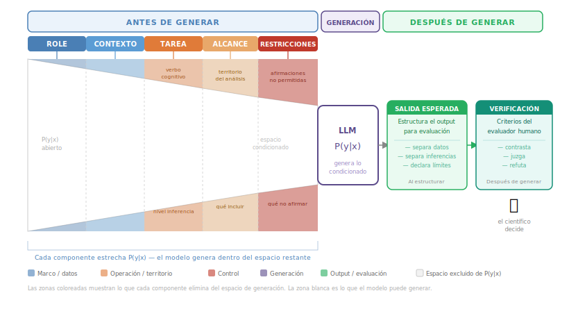
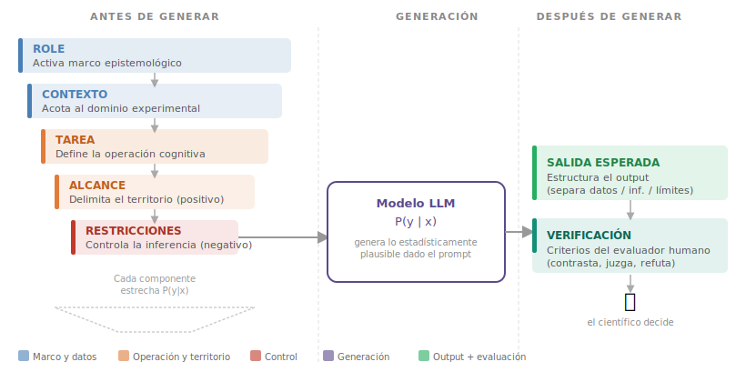

::: {.callout-note title="Descargar este módulo"}
También disponible en [PDF](index.pdf) y [Word](index.docx).
:::

## Introducción

En el Capítulo 2 aprendiste a ver el prompt como una **variable de control**: un conjunto de condiciones que restringen la distribución de probabilidad del modelo — el contexto \(x\) en \(P(y \mid x)\) — y condicionan el tipo de texto que produce. Viste que cambiar el rol, el contexto o la tarea produce respuestas radicalmente distintas, incluso con el mismo modelo.

En este capítulo la pregunta cambia:

> ¿Cómo saber si lo que produjo el modelo **puede evaluarse**?

Un prompt bien redactado puede generar una respuesta fluida, coherente y completamente inverificable. Aquí aprendemos a diseñar prompts que no solo produzcan respuestas, sino que las hagan **examinables por criterios externos** — lo que llamamos **prompting científico**: el diseño de prompts contextualizados, acotados y verificables, orientados a producir salidas controlables, reproducibles y evaluables [@sahoo2024]. Este capítulo no asume que la IA valide conocimiento; establece **cómo el diseño del prompt habilita la verificación humana**. En dominios biomédicos, la fluidez del modelo no sustituye validación experimental [@thirunavukarasu2023].

La diferencia no está en la calidad de la redacción. Está en si el diseño del prompt habilita — o impide — que tú puedas juzgar lo que recibiste.

Este enfoque articula cuatro competencias del curso:

- **2.1 Prompting Científico** (diseño de instrucciones justificadas),
- **2.2 Pensamiento Crítico** (evaluar y cuestionar salidas),
- **2.3 Metodología y Rigor** (reproducibilidad y trazabilidad),
- **2.4 Desarrollo Asistido por IA** (uso metodológico en proyectos técnicos).


## Dos modos de prompting en el trabajo científico

En el Capítulo 2 aprendimos a estructurar un prompt con cinco componentes. Esa estructura le da orientación al modelo y reduce la ambigüedad — pero no siempre se aplica con el mismo grado de precisión, ni debería. En ciencia se trabaja en dos modos distintos según la fase: a veces necesitas **abrir el espacio de posibilidades** — explorar, generar hipótesis, pensar por analogía; otras veces necesitas **cerrar y evaluar** — verificar, analizar, concluir. Ambos modos son legítimos y científicos. La pregunta no es cuál es "más riguroso", sino **cuál corresponde a lo que estás haciendo en este momento**.

### 🔍 Modo exploratorio

> Abierto, divergente, generativo

**Corresponde a esta fase cuando:**

1. **No sabes aún qué estás buscando**
   - Fase de ideas o lluvia de ideas
   - Generación de hipótesis o metáforas

2. **Quieres ampliar el espacio de posibilidades**
   - Diseño conceptual, narrativas, enfoques alternativos
   - Útil para romper marcos rígidos o sesgos previos

3. **El valor está en la originalidad, no en la verificabilidad inmediata**
   - Ensayos teóricos, pensamiento especulativo, divulgación, docencia creativa

4. **Trabajas con sistemas complejos aún mal definidos**
   - Sistemas biológicos, sociales o simbólicos en etapa de formalización


**Ejemplo**:

```txt {.prompt}
Explora analogías entre regulación genética y lenguajes simbólicos.
```

::: {.callout-warning}

## Riesgos de usar el modo exploratorio fuera de fase

- Produce respuestas plausibles sin explicitar supuestos ni condiciones de refutación.
- Favorece la sobreinterpretación y analogías engañosas.
- No es adecuado para decisiones técnicas o conclusiones formales — en esas fases, se necesita el modo verificable.

:::


### 🔬 Modo verificable

> Acotado, trazable, evaluable

**Corresponde a esta fase cuando:**

1. **La pregunta está bien definida**
   - Variables claras, dominio específico, objetivo explícito

2. **Necesitas precisión, trazabilidad y control de supuestos**
   - Revisión de literatura, análisis de datos, validación de hipótesis

3. **El resultado debe ser evaluable por criterios externos**
   - Reproducibilidad, referencias, consistencia lógica, datos observables

4. **Estás en fase de convergencia**
   - Refinar, comparar, decidir, escribir resultados, diseñar experimentos

**Ejemplo**:

```txt {.prompt}
Resume de manera estructurada los mecanismos de regulación transcripcional del operón lac en Escherichia coli de acuerdo con la información curada en RegulonDB. Incluye:

- Factores regulatorios involucrados  
- Sitios de unión en el DNA  
- Señales ambientales  
- Mecanismo molecular de acción  
- Integración regulatoria del sistema  

```


#### Riesgos de usar el modo verificable fuera de fase

- Puede **reducir el espacio de exploración** si se aplica demasiado pronto en el proceso.
- Puede **heredar sesgos** del contexto, supuestos y fuentes seleccionadas.
- Puede generar una **falsa sensación de rigor** si la verificación se formula de manera retórica y no operativa.


## Guía de Decisión

| Fase del Trabajo | → Modo de prompting |
|------------------|---------------------|
| Exploración | → Exploratorio |
| Generación de hipótesis | → Exploratorio → Verificable |
| Formalización | → Verificable |
| Análisis / validación | → Verificable |
| Síntesis conceptual | → Exploratorio o Verificable |
| Comunicación (según audiencia) | → Exploratorio o Verificable |


### Criterio práctico rápido

Antes de escribir un prompt, pregúntate:

**¿Estoy abriendo posibilidades o cerrando sobre evidencia?**

- Abrir, explorar, generar → Modo exploratorio
- Verificar, analizar, concluir → Modo verificable


## Ejemplos: el mismo tema, distinto modo

Los siguientes pares muestran cómo el mismo tema científico se aborda de forma diferente según la fase. No hay un prompt "mejor" — hay uno más adecuado para lo que se busca en ese momento.

### Regulación Genética

::: {.panel-tabset}

## Exploratorio

```txt {.prompt}
Imagina la regulación genética como un sistema de toma de decisiones.

¿Qué metáforas o estructuras abstractas ayudan a entender cómo una célula
elige entre múltiples programas de expresión?
```

**Uso**: Exploración conceptual, generación de analogías para enseñanza

## Verificable

```txt {.prompt}
Describe los mecanismos de regulación transcripcional dependientes de
factores sigma en E. coli, indicando condiciones de activación y genes regulados,
según la evidencia experimental reportada.
```

**Uso**: Revisión técnica, preparación de materiales con base en evidencia citable

:::

### Expresión diferencial (RNA-seq)

::: {.panel-tabset}

## Exploratorio

```txt {.prompt}
Si la expresión diferencial fuera un lenguaje de estados celulares,
¿qué patrones podrían emerger entre tejido sano y canceroso?
```

**Uso**: Generación de hipótesis, exploración conceptual antes de formalizar el análisis

## Verificable

```txt {.prompt}
Describe los pasos conceptuales de un análisis de expresión diferencial
entre tejido tumoral y tejido sano con RNA-seq, indicando qué criterios
estadísticos permiten distinguir genes diferencialmente expresados y cómo
podrían verificarse los resultados.
```

**Uso**: Preparación metodológica, revisión de criterios antes de ejecutar el análisis
:::

### Interpretación de resultados ómicos

::: {.panel-tabset}

## Exploratorio

```txt {.prompt}
Explora narrativas funcionales que conecten genes sobreexpresados
con procesos adaptativos celulares.
```

**Uso**: Fase de síntesis conceptual, generación de hipótesis funcionales antes de validar

## Verificable

```txt {.prompt}
Describe cómo se interpreta un análisis de enriquecimiento GO (BP)
para un conjunto de genes sobreexpresados, especificando los criterios
de significancia utilizados (p-valor ajustado, umbral FDR) y cómo
verificarías que los términos enriquecidos son biológicamente relevantes
para el contexto experimental.
```

**Uso**: Interpretación formal de resultados, escritura de la sección de análisis funcional
:::

## Anatomía del Prompt en Modo Verificable

Cuando el propósito es verificar, analizar o concluir — el modo verificable — el prompt necesita más que buena estructura: necesita que esa estructura **habilite la evaluación de lo que produjo**. En el Capítulo 2 trabajamos con cinco componentes base. Aquí incorporamos dos más — **Alcance** y **Verificación** — que son los que convierten un prompt bien redactado en un instrumento metodológicamente evaluable. El prompt en modo verificable opera con **siete componentes**.

Un prompt en este modo funciona como un **protocolo experimental escrito**: explicita *qué se quiere*, *bajo qué supuestos* y *cómo se evaluará*.

El siguiente diagrama muestra cómo operan los siete componentes en conjunto: los cinco primeros condicionan progresivamente la distribución interna del modelo — cada uno **elimina una porción del espacio de posibles respuestas** — antes de que genere cualquier texto; los dos últimos estructuran y evalúan la salida una vez recibida.

{fig-align="center" width="100%"}

En los próximos apartados exploramos cada uno en detalle. Al terminar, encontrarás una tabla de síntesis que los integra.

### Los siete componentes en detalle

#### ROLE — Marco epistemológico del razonamiento

En el Capítulo 2 aprendiste a definir roles específicos y operativos — no "experto en bioinformática", sino "analista de RNA-seq evaluando calidad de réplicas". En el modo verificable, el rol cumple una función adicional.

Cuando defines un rol, no solo le dices al modelo "quién habla" — le estás diciendo **qué cuenta como una buena respuesta**: ¿claridad pedagógica?, ¿rigor metodológico?, ¿precisión estadística? Eso es el **marco epistemológico**: el conjunto de criterios con los que el modelo organiza, prioriza y evalúa la información. El mismo tema con el mismo modelo puede producir respuestas radicalmente distintas según el rol, porque cada rol activa criterios distintos de lo que es relevante, suficiente y correcto [@sahoo2024; @wei2022].

Mismo rol base, misma tarea — distinto marco epistemológico:

**Marco explicativo-pedagógico** → prioriza claridad, accesibilidad, criterios comprensibles:

```txt {.prompt}
Actúa como analista de RNA-seq evaluando calidad de réplicas,
con enfoque pedagógico para explicar los criterios a estudiantes de posgrado.
```

**Marco estadístico-decisional** → prioriza justificación cuantitativa y trazabilidad de decisiones:

```txt {.prompt}
Actúa como analista de RNA-seq evaluando calidad de réplicas,
con criterio estadístico estricto para justificar decisiones de exclusión de muestras.
```

| Rol base (Cap 2) | Marco epistemológico (Cap 3) | Criterio implícito | Pregunta que guía la respuesta |
|---|---|---|---|
| Analista de RNA-seq evaluando calidad de réplicas | Explicativo-pedagógico | ¿Es comprensible? | ¿Cómo explico el criterio de exclusión? |
| Analista de RNA-seq evaluando calidad de réplicas | Estadístico-decisional | ¿Es justificable? | ¿Qué umbral estadístico justifica excluir esta muestra? |

La respuesta no cambia de tema: cambia de lo que cuenta como relevante y suficiente.

::: {.callout-note collapse="true"}
## ¿Cómo activa el LLM el marco epistemológico?

El modelo no "entiende" el rol — lo que ocurre es asociación estadística [@brown2020]. Durante el entrenamiento procesó millones de textos producidos por distintos tipos de expertos: revisiones editoriales, libros de texto, reportes técnicos, artículos científicos. Cada uno tiene patrones propios: vocabulario, estructura argumental, qué se cuestiona, qué nivel de certeza se usa.

Cuando defines un rol, desplazas P(y|x) hacia los tokens estadísticamente asociados con ese tipo de texto [@sahoo2024]. El mecanismo de atención del transformer mantiene esa condición activa durante toda la generación — cada token producido atiende continuamente al rol especificado [@vaswani2017].

**Un rol funciona bien cuando el tipo de texto que describe está ampliamente representado en los datos de entrenamiento.** Un rol muy específico o inusual puede no activar ningún patrón coherente: el modelo no tiene con qué asociarlo y tiende a responder como asistente genérico.
:::

::: {.callout-note collapse="true"}
## Marcos epistemológicos en la práctica científica

No hay un número fijo de marcos — el límite lo pone el corpus de entrenamiento. Cualquier contexto profesional con suficiente texto representado puede activar uno [@brown2020; @wei2022]. En investigación científica, los más comunes son:

| Marco | Rol típico | Criterio central |
|---|---|---|
| Explicativo-pedagógico | Profesor, autor de libro de texto | ¿Es comprensible? |
| Crítico-metodológico | Revisor de revista, evaluador de protocolo | ¿Es riguroso? |
| Estadístico-decisional | Bioestadístico, analista de datos | ¿Es cuantificable y justificable? |
| Analítico-interpretativo | Investigador analizando resultados | ¿Es plausible biológicamente? |
| Técnico-operativo | Bioinformático, ingeniero de pipelines | ¿Es reproducible y documentado? |
| Síntesis-conceptual | Autor de revisión, teórico | ¿Es coherente entre estudios? |
| Prospectivo-propositivo | Escritor de propuestas, diseñador de proyectos | ¿Es factible y novedoso? |
| Comunicativo-divulgativo | Divulgador, periodista científico | ¿Es accesible al público general? |

**¿En qué marco caen los artículos de PubMed, Nature o Nucleic Acids Research?**

En ninguno solo — cada sección activa un marco distinto:

| Sección | Marco | Criterio dominante |
|---|---|---|
| Introducción | Síntesis-conceptual | ¿Qué se sabe y qué gap existe? |
| Métodos | Técnico-operativo | ¿Es reproducible y justificado? |
| Resultados | Analítico-interpretativo | ¿Qué muestran los datos? |
| Discusión | Analítico-interpretativo + Prospectivo-propositivo | ¿Qué significa? ¿Qué sigue? |
| Abstract | Síntesis comprimida | ¿Cuál es el mensaje central? |

Revistas como Nature, Science o Nucleic Acids Research agregan una capa adicional de **Crítico-metodológico** — su estándar editorial es uno de los patrones mejor representados en el corpus de entrenamiento. Por eso especificar la sección del artículo es una forma efectiva de activar el marco:

```txt {.prompt}
Actúa como autor de la sección de Discusión de un artículo en Nucleic Acids Research.
```

activa un marco muy distinto a:

```txt {.prompt}
Actúa como autor de la sección de Métodos del mismo artículo.
```
:::

::: {.callout-tip}
## Cómo saber si tu rol está funcionando — y cómo definirlo bien

**Señales de que el rol no está activando un marco coherente:**

- La respuesta no cambia si quitas el rol del prompt.
- El modelo *describe* lo que haría esa persona en lugar de *adoptar* el rol.
- El estilo es inconsistente a lo largo de la respuesta.
- Aparece lenguaje genérico ("¡Claro! Con gusto...") en lugar del registro del rol.

**Recomendaciones para definir roles que funcionen:**

| Recomendación | Rol débil | Rol fuerte |
|---|---|---|
| Usa roles con texto abundante en entrenamiento | Jefe de bioinformática de startup, 2019 | Revisor metodológico de revista científica |
| Especifica función, no solo identidad | Experto en bioinformática | Analista de RNA-seq evaluando calidad de réplicas |
| Evita roles con demasiados atributos compuestos | Estadístico bayesiano especialista en hongos patógenos de plantas tropicales | Estadístico evaluando supuestos de normalidad en datos de expresión |
| Alinea rol, tarea y contexto | Rol de revisor con tarea exploratoria | Rol de revisor con tarea de identificar debilidades metodológicas |
:::

::: {.exercise-box}
**Para practicar:** Los siguientes dos roles tienen el mismo tema y la misma tarea. ¿Qué marco epistemológico activa cada uno? ¿En qué aspectos diferiría la respuesta?

```txt {.prompt}
Actúa como profesor de biología molecular a nivel licenciatura.
Analiza el diseño experimental de este estudio sobre expresión génica diferencial.
```

```txt {.prompt}
Actúa como revisor experto para una revista internacional de genómica funcional.
Analiza el diseño experimental de este estudio sobre expresión génica diferencial.
```

::: {.callout-note collapse="true"}
## Respuesta

| Rol | Marco que activa | Criterio implícito | Pregunta que guía |
|-----|-----------------|-------------------|-------------------|
| Profesor de licenciatura | Explicativo-pedagógico | ¿Es comprensible? | ¿Qué necesita entender un estudiante? |
| Revisor de revista internacional | Crítico-metodológico | ¿Es riguroso? | ¿Qué fallaría en revisión por pares? |

El profesor priorizará claridad, ejemplos y secuencia lógica. El revisor priorizará debilidades metodológicas, controles ausentes y afirmaciones no respaldadas. Mismo diseño experimental — distinto estándar de lo que cuenta como relevante.
:::

:::


#### CONTEXTO — Datos del experimento, no solo el tema

El Capítulo 2 mostró que el contexto reduce ambigüedad al delimitar dominio, organismo y propósito. En el modo verificable, el contexto debe ir un paso más allá: no basta indicar *de qué se habla* — hay que especificar **qué información factual está disponible**: qué experimento se hizo, qué variables se midieron, cuántas réplicas hay, con qué metodología, bajo qué condiciones.

El modelo rellena vacíos cuando el contexto es ambiguo. En un prompt verificable, esos vacíos se convierten en supuestos implícitos no declarados — exactamente lo que la Verificación debe poder detectar.

**Qué error mitiga:** alucinaciones contextuales y suposiciones no justificadas.

**Comparación: contexto insuficiente vs. contexto verificable**

Sin parámetros factales explícitos, el modelo rellena los vacíos con supuestos típicos del dominio — que pueden no corresponder a tu diseño experimental:

```txt {.prompt}
ROLE:
Revisor metodológico experto.

CONTEXTO:
Experimento de RNA-seq en ratón.

TAREA:
Evalúa si el diseño experimental es adecuado para el análisis.
```

Al declarar los parámetros factales del experimento, cada afirmación del modelo puede contrastarse contra los datos reales:

```txt {.prompt}
ROLE:
Revisor metodológico experto.

CONTEXTO:
RNA-seq en Mus musculus (C57BL/6J), tejido hepático.
Condición: dieta alta en grasas vs. dieta control.
Réplicas: 3 biológicas por condición (n = 6 total).
Secuenciación: paired-end 150 bp, Illumina NovaSeq 6000, ~40M lecturas por muestra.
Alineamiento: STAR v2.7.10a contra GRCm39. Conteo: featureCounts.
Ninguna muestra fue excluida por control de calidad.

TAREA:
Evalúa si el número de réplicas y la profundidad de secuenciación son suficientes
para detectar expresión diferencial con potencia estadística adecuada.
```

El primer prompt deja que el modelo asuma cepa, tejido, profundidad y condiciones — cada suposición no declarada es una alucinación potencial. El segundo fija los parámetros factales y convierte la evaluación en verificable: si el modelo afirma que 3 réplicas son insuficientes, puedes evaluar ese juicio frente a los datos reales.


#### TAREA — Instrucción central

En el diseño de un prompt científico, **el verbo utilizado no es un detalle estilístico**,
sino una señal explícita del **tipo de inferencia** que se espera del modelo. Verbos distintos
activan operaciones cognitivas diferentes y, por lo tanto, implican **niveles distintos de riesgo epistemológico** [@anderson2001; @wei2022].

Por ejemplo, no es equivalente pedir que un modelo describa un fenómeno biológico que pedirle que lo interprete o que decida entre hipótesis alternativas.

::: {.callout-note}
## ¿TAREA u OBJETIVO?

En otros frameworks de prompt engineering (como CO-STAR) este componente se llama **Objetivo**. La distinción es sutil pero relevante en el contexto científico:

- **Objetivo** → *para qué* (propósito, resultado esperado): "Identificar genes candidatos para validación experimental"
- **Tarea** → *qué hacer* (operación concreta): "Analiza la distribución de valores de expresión y compara los genes con logFC > 2"

Preferimos **TAREA** en este capítulo porque orienta la atención al **verbo** — que es lo que determina el nivel de inferencia y el tipo de verificación requerido. Un mismo objetivo puede lograrse con distintas tareas, y cada una implica riesgos epistemológicos distintos [@quintero2025; @schulhoff2024].
:::


##### Clasificación de verbos en investigación según nivel de inferencia y riesgo epistemológico

En el diseño de prompts científicos, el verbo define la operación cognitiva esperada y el nivel de compromiso epistemológico de la respuesta [@anderson2001]. La siguiente tabla clasifica verbos comunes en investigación según su nivel de inferencia y el riesgo asociado a su uso impreciso.

|  Nivel | Verbo representativo | Tipo de afirmación | Riesgo clave | Requisito mínimo |
|--------|---------------------|-------------------|--------------|-----------------|
| 🟢 Descriptivo | Describir, Resumir | Factual / Sintética | Incompletitud u omisión | Objeto o fuente delimitada |
| 🟡 Analítico | Analizar, Comparar | Interpretativa / Relacional | Criterios implícitos; correlación ≠ causalidad | Dimensiones y criterios definidos |
| 🟠 Inferencial | Explicar (mecanismo), Interpretar | Causal / De significado | Especulación no sustentada | Evidencia o marco teórico explícito |
| 🔴 Decisional | Evaluar, Concluir, Proponer | Conclusiva / Prospectiva | Falsa certeza; cierre prematuro | Marco evaluativo + declaración de límites |

::: {.callout-note collapse="true"}
## Tabla completa de verbos por nivel de inferencia

| Nivel | Tipo de verbo | Verbo | Operación cognitiva | Tipo de afirmación | Riesgo epistemológico | Requisito metodológico mínimo |
|-------|--------------|--------|----------------------|--------------------|-----------------------|-------------------------------|
| 🟢 1 | Descriptivo | Describir | Exponer información estructurada | Descriptiva | Omisión o incompletitud | Objeto o fuente delimitada |
| 🟢 1 | Descriptivo | Enumerar | Listar elementos | Factual | Lista incompleta | Criterio de inclusión explícito |
| 🟢 1 | Descriptivo | Resumir | Sintetizar información | Sintética | Pérdida de matices | Extensión definida |
| 🟢 1 | Descriptivo | Definir | Precisar concepto | Conceptual | Vaguedad o circularidad | Marco disciplinar indicado |
| 🟢 1 | Descriptivo | Identificar | Señalar elementos presentes | Observacional | Confusión entre presencia y relevancia | Fuente o datos explícitos |
| 🟡 2 | Analítico | Analizar | Descomponer y examinar relaciones | Interpretativa | Ambigüedad en criterios | Criterios analíticos explícitos |
| 🟡 2 | Analítico | Comparar | Contrastar dimensiones | Relacional | Comparación superficial | Dimensiones definidas |
| 🟡 2 | Analítico | Relacionar | Establecer vínculos | Asociativa | Confundir correlación con causalidad | Tipo de relación especificado |
| 🟡 2 | Analítico | Clasificar | Organizar por categorías | Taxonómica | Criterios implícitos | Sistema de clasificación definido |
| 🟡 2 | Analítico | Examinar | Inspeccionar en detalle | Interpretativa | Falta de profundidad | Foco analítico claro |
| 🟠 3 | Inferencial | Explicar (mecanismo) | Proponer mecanismo o razón | Causal / mecanística | Especulación no sustentada | Evidencia o marco teórico explícito |
| 🟠 3 | Inferencial | Interpretar | Dar significado a datos | De significado | Sobreinterpretación | Datos delimitados |
| 🟠 3 | Inferencial | Inferir | Derivar conclusión lógica | Lógica | Inferencia no justificada | Premisas explícitas |
| 🟠 3 | Inferencial | Argumentar | Defender una posición | Razonada | Falta de sustento | Evidencia citada |
| 🟠 3 | Inferencial | Justificar | Fundamentar una afirmación | Normativa / lógica | Razonamiento circular | Criterios explícitos |
| 🔴 4 | Decisional | Evaluar | Aplicar criterios para emitir juicio | Crítica | Criterios implícitos | Marco evaluativo definido |
| 🔴 4 | Decisional | Determinar | Concluir con cierre | Conclusiva | Falsa certeza | Nivel de evidencia declarado |
| 🔴 4 | Conclusivo / Decisional | Concluir | Integrar evidencia en cierre argumental | Conclusiva | Cierre prematuro | Declaración explícita de límites |
| 🔴 4 | Propositivo | Proponer | Generar hipótesis o solución | Prospectiva | Especulación presentada como evidencia | Base conceptual clara |
| 🔴 4 | Propositivo | Diseñar | Crear estructura o método | Constructiva | Falta de viabilidad | Restricciones definidas |
| 🔴 4 | Decisional | Decidir | Elegir alternativa | Normativa | Elección arbitraria | Criterios comparativos explícitos |

:::

::: {.callout-note collapse=”true”}
## Nota sobre el verbo “explicar”
El verbo “explicar” puede referirse a una descripción conceptual o a una explicación mecanística. Cuando implica proponer causas o mecanismos, el prompt exige mayor evidencia y control metodológico, ya que el compromiso epistemológico es más alto.

- **(Descriptivo — bajo compromiso)** `Describe la relación entre la expresión del gen X y el gen Y en células tumorales.`
  Solo se pide caracterizar un patrón observado (por ejemplo, coexpresión).
- **(Explicación causal — alto compromiso)** `Explica por qué el aumento en la expresión del gen X podría estar causando la sobreexpresión del gen Y.`
  Se solicita: a) una relación causal; b) supuestos sobre dirección del efecto.
:::


El nivel de inferencia y el tipo de afirmación no son categorías independientes, sino expresiones del **grado de compromiso epistemológico** que impone el verbo utilizado.

Esta clasificación no prohíbe verbos de nivel alto (🟠–🔴). Indica que, conforme aumenta el alcance de la afirmación solicitada, debe aumentar proporcionalmente:

- la explicitación de evidencia,  
- la delimitación de supuestos,  
- la claridad de los criterios,  
- y los mecanismos de verificación.

En prompting científico, el verbo no es un detalle estilístico: es una especificación funcional del tipo de razonamiento solicitado — en sentido operativo, indica al modelo qué tipo de patrones estadísticos activar y qué tipo de secuencias generar dentro del espacio condicionado por el prompt.

Podemos entender esta progresión como un gradiente de compromiso inferencial:

- **Descriptivo** → Bajo compromiso (caracterización de información disponible).
- **Interpretativo** → Compromiso moderado (requiere marco conceptual).
- **Causal / Predictivo** → Alto compromiso (implica mecanismos o generalización).
- **Decisional / Normativo** → Muy alto compromiso (implica criterio de acción o cierre).

A mayor compromiso inferencial, mayor exigencia metodológica en el diseño del prompt.


```txt {.prompt}
TAREA:
Describe los genes sobreexpresados (logFC > 1, FDR < 0.05) en tejido hepático
de ratón bajo dieta alta en grasas vs. dieta control.
```

🟢 **Nivel descriptivo** — caracteriza un patrón observable y verificable directamente contra los datos crudos del análisis.

```txt {.prompt}
TAREA:
Interpreta el significado biológico de los genes sobreexpresados en tejido hepático,
en el contexto de la respuesta metabólica al estrés lipídico.
```

🟠 **Nivel inferencial** — dar significado a los datos requiere asumir un marco interpretativo (aquí: respuesta metabólica al estrés lipídico). Ese marco debe declararse explícitamente en algún componente del prompt: en TAREA si define el lente del análisis, en CONTEXTO si es parte del diseño experimental, en ALCANCE si delimita el territorio interpretativo, o en RESTRICCIONES si funciona como control epistemológico (guardrail). Lo que no puede ocurrir es que quede implícito — si el modelo lo elige por su cuenta, la respuesta no es verificable.

Reconocer el nivel de inferencia solicitado permite evaluar si la respuesta generada es proporcional a la evidencia disponible, y qué otros componentes del prompt deben reforzarse para soportar ese nivel.


> En el Capítulo 4 estas distinciones se incorporan explícitamente en los protocolos multi-fase, donde el nivel de inferencia de cada paso determina qué tipo de verificación se requiere.


#### ALCANCE — Delimitación positiva del análisis

Define positivamente el territorio del análisis: qué incluir, en qué nivel y con qué tipo de evidencia. Establece la frontera estructural del razonamiento antes de que el modelo comience a generar.

Delimita:

- Qué dimensión del fenómeno se analizará.
- En qué nivel (estadístico, metodológico, conceptual, mecanístico).
- Qué tipo de evidencia es pertinente considerar.
- A qué población o sistema aplica el análisis.

**Qué error mitiga:** expansión temática y desplazamiento a niveles no solicitados.

```txt {.prompt}
ROLE:
Revisor metodológico experto.

CONTEXTO:
Análisis de expresión diferencial por RNA-seq con 3 réplicas por condición.

TAREA:
Evalúa la consistencia estadística de los resultados entre réplicas biológicas.

ALCANCE:
Trabaja exclusivamente en el nivel transcriptómico.
Considera solo genes con logFC > 1 y FDR < 0.05.
Evalúa únicamente el tejido hepático reportado en el experimento.
```

::: {.callout-note collapse="true"}
## Ejemplos de ALCANCE por tipo de análisis en genómica

Todos los enunciados delimitán positivamente el territorio del análisis — especifican qué incluir, en qué nivel y con qué evidencia. Los "no permitidos" van en RESTRICCIONES, no aquí.

| Tipo de análisis | Ejemplo de ALCANCE |
|---|---|
| RNA-seq | Trabaja en el nivel transcriptómico. Considera solo genes proteínas-codificantes con logFC > 1 y FDR < 0.05. |
| WGS / variantes | Evalúa solo variantes en regiones codificantes con cobertura ≥ 20×. Trabaja en el nivel de variante individual. |
| Metagenómica | Trabaja a nivel de género taxonómico. Enfoca el análisis en la composición relativa de la comunidad microbiana. |
| ChIP-seq / epigenómica | Restringe el análisis a regiones promotoras (±2 kb del TSS). Considera solo picos con q-value < 0.01. |
| GWAS | Considera solo SNPs con MAF > 0.05 en la población reportada. Trabaja en el nivel de asociación estadística. |
| Proteómica cuantitativa | Incluye solo proteínas identificadas con ≥ 2 péptidos únicos y FDR < 1%. Trabaja en el nivel de cuantificación relativa entre condiciones. |

Nota: los enunciados de esta tabla definen **qué analizar**. Frases como "no infierias mecanismos" o "no generalices a vías metabólicas" son RESTRICCIONES — pertenecen al componente siguiente.
:::


#### RESTRICCIONES — Controles epistemológicos (guardrails)

En el Capítulo 2 las restricciones acotaban extensión, fuente o alcance temático. En el modo verificable cumplen un papel adicional: controlan **qué tipo de afirmaciones puede hacer el modelo** — no solo cuánto dice, sino qué clase de compromiso epistemológico asume.

La diferencia clave es que aquí las restricciones no limitan el formato, sino el **nivel de inferencia**: impiden que el modelo presente hipótesis como hechos, afirme causalidad donde solo hay correlación, o introduzca mecanismos no evaluados experimentalmente.

```txt {.prompt}
RESTRICCIONES:
No afirmes causalidad entre expresión génica y fenotipo.
No introduzcas mecanismos regulatorios no evaluados experimentalmente.
Declara explícitamente cualquier supuesto necesario para la interpretación.
```

**Qué error mitiga:** sobreconfianza inferencial y afirmaciones que exceden la evidencia disponible.

::: {.callout-tip}
## ALCANCE vs RESTRICCIONES: la distinción práctica

Ahora que los has visto por separado, conviene fijar la diferencia [@schulhoff2024; @sahoo2024]:

| Componente | Pregunta que responde | Framing | Ejemplo |
|---|---|---|---|
| ALCANCE | ¿En qué territorio opera el análisis? | Positivo: qué incluir | "Trabaja en el nivel estadístico" |
| RESTRICCIONES | ¿Qué razonamientos están prohibidos? | Negativo: qué evitar | "No afirmes causalidad" |

**Regla práctica:** si puedes escribir la instrucción sin un "no", pertenece al ALCANCE. Si necesitas una negación, es una RESTRICCIÓN. Un prompt bien diseñado usa ambos: el ALCANCE define el espacio de análisis; las RESTRICCIONES controlan cómo razonar dentro de ese espacio.
:::


#### SALIDA ESPERADA — Condición de evaluabilidad

En el Capítulo 2 la salida esperada definía el *formato* de la respuesta (lista, tabla, secciones). En el modo verificable, su función es más profunda: la estructura de la salida **determina si la respuesta puede evaluarse**. Sin una organización explícita, no hay dónde separar datos de inferencias, ni inferencias de conclusiones — y la Verificación no tiene sobre qué operar.

Una salida bien diseñada para el modo verificable permite:

- Separar datos, inferencias y conclusiones en secciones distintas.
- Comparar respuestas entre iteraciones del mismo prompt.
- Identificar supuestos y declarar límites del análisis.
- Integrar el resultado en reportes, notebooks o pipelines reproducibles.

> La salida no es estética: es la condición que hace posible la verificación.

**Ejemplo — análisis de expresión diferencial (RNA-seq):**

Una salida sin estructura deja mezclados datos, inferencias y conclusiones — la verificación no tiene dónde operar:

```txt {.prompt}
SALIDA ESPERADA:
Redacta un párrafo con los resultados del análisis.
```

Una salida estructurada separa explícitamente cada tipo de afirmación y declara los supuestos, habilitando la evaluación crítica:

```txt {.prompt}
SALIDA ESPERADA:
Organiza tu respuesta en tres secciones claramente etiquetadas:

1. Observación estadística: lista los genes con logFC > 1 y FDR < 0.05,
   indicando los valores exactos para cada uno.
2. Interpretación: describe el patrón de expresión en el contexto experimental.
   Señala explícitamente cualquier supuesto que asumas para la interpretación.
3. Límites del análisis: indica qué preguntas no puede responder este análisis
   con los datos disponibles y qué evidencia adicional sería necesaria.
```

La diferencia no es de formato sino de evaluabilidad: el segundo prompt define dónde termina el dato y dónde comienza la inferencia, lo que hace posible que un humano contraste cada sección por separado.

::: {.callout-tip}
## Formatos de salida
Consulta el [**Apéndice A — Ejemplos de formatos de salida**](../apendices/apendice_a.md) para una galería de estructuras reutilizables (listas, tablas, bloques etiquetados, plantillas para notebooks).
:::

#### 🧩 VERIFICACIÓN — Evaluabilidad y control epistemológico

::: {.callout-note}
## ¿Va antes o después de SALIDA ESPERADA?

La mayoría de los frameworks de prompt engineering (CO-STAR, Schulhoff et al., 2024) ubican el formato de salida antes de los criterios de evaluación — la lógica es: primero define el contenedor, luego qué verificar dentro de él.

Sin embargo, el orden no es dogmático. Las instrucciones de VERIFICACIÓN cumplen dos funciones distintas:

- **Si moldean la salida** ("incluye nivel de certeza en cada afirmación") → conviene ponerlas antes o integrarlas con SALIDA ESPERADA, para que el modelo sepa el propósito antes de conocer el formato.
- **Si son criterios para el evaluador humano** ("el investigador contrastará contra los datos crudos") → su posición en el prompt no afecta la generación.

En la práctica, muchos prompts verificables mezclan ambas funciones. La regla práctica: si una instrucción de VERIFICACIÓN cambia *qué produce* el modelo, anticípala. Si solo define *cómo lo evaluarás tú*, puede ir al final.
:::

La verificación es el componente que distingue con mayor claridad al *prompting científico* de otras formas de interacción con IA. No implica que la IA valide su propia respuesta, sino que el **prompt esté diseñado para que un humano pueda evaluar críticamente lo generado**.

::: {.callout-important}
Un modelo no puede verificar empíricamente sus afirmaciones.
La verificación no transforma una respuesta en *verdadera*; la convierte en **evaluable**.
:::

**¿Por qué no puede el modelo verificar sus propias afirmaciones?**

El modelo genera texto según P(y|x) — la distribución de probabilidad sobre los posibles tokens dado el prompt. Esa distribución está determinada por los pesos del modelo y no cambia con el diseño del prompt: el modelo no accede a datos externos ni contrasta contra la realidad, solo genera lo que es estadísticamente plausible según su entrenamiento. La verificación opera *después* y *fuera* del modelo — es un proceso del científico, no del sistema.

**Los tres momentos de la verificación**

**1. En el diseño del prompt** — al incluir el componente VERIFICACIÓN, el científico anticipa qué tipo de afirmaciones producirá el modelo y declara de antemano qué evidencia las respaldaría o refutaría. Esto es operacionalizar la evaluabilidad antes de ejecutar el prompt.

**2. En la estructura de la salida** — la SALIDA ESPERADA separa afirmaciones por tipo (observacionales, inferenciales, conclusivas), de modo que cada una puede auditarse por separado. Sin esa separación, los distintos tipos quedan mezclados y son imposibles de evaluar individualmente.

**3. En el proceso posterior** — el científico contrasta cada tipo de afirmación contra su fuente de validación correspondiente:

- Afirmaciones observacionales → contra los datos crudos del experimento.
- Afirmaciones inferenciales → contra la literatura o el marco teórico declarado.
- Afirmaciones conclusivas → contra consistencia lógica y soporte evidencial.

::: {.callout-note collapse="true"}
## Ejemplo: los tres momentos en un análisis RNA-seq

**Momento 1 — En el diseño del prompt** (componente VERIFICACIÓN):

```txt {.prompt}
VERIFICACIÓN:
Para cada afirmación, indica:
- Si está respaldada por los datos del experimento, por literatura publicada,
  o es inferencia propia.
- El nivel de certeza (alta / moderada / especulativa).
- Qué evidencia adicional sería necesaria para sostenerla con mayor solidez.
```

El científico ha declarado *antes de ejecutar* qué se evaluará y bajo qué criterio.

**Momento 2 — En la estructura de la salida** (componente SALIDA ESPERADA):

```txt {.prompt}
SALIDA ESPERADA:
Organiza tu respuesta en tres secciones:
1. Observación estadística: genes con logFC > 1 y FDR < 0.05, con valores exactos.
2. Interpretación: patrón de expresión en el contexto experimental. Declara supuestos.
3. Límites del análisis: qué preguntas no puede responder este análisis.
```

La separación en secciones hace que cada tipo de afirmación sea auditable por separado.

**Momento 3 — En el proceso posterior** (el científico, no el modelo):

| Sección del output | ¿Contra qué se contrasta? |
|---|---|
| Observación estadística | Tabla de resultados DESeq2 / edgeR |
| Interpretación | Literatura sobre respuesta metabólica en hígado de ratón |
| Límites del análisis | Diseño experimental original: ¿los límites declarados son completos? |

Si el modelo afirma que un gen está sobreexpresado con logFC = 2.3 y ese valor no aparece en los datos crudos, la alucinación es **detectable** porque hay una sección específica contra qué contrastarla.
:::

La verificación no detiene las alucinaciones — las hace **detectables**. Lo que cambia no es lo que el modelo genera, sino que el científico tiene criterios explícitos para identificar cuándo esa salida no corresponde a la evidencia.

#### Anti-ejemplo: cuando “pedir verificación” no es verificación

El siguiente prompt parece científico, pero no define criterios evaluables:

```txt {.prompt}
Explica la regulación génica en bacterias.
Asegúrate de que sea correcta y esté científicamente validada.
```

**Problema**:

- No define qué significa “correcta”.  
- No especifica fuentes aceptables.  
- No distingue tipos de evidencia.  
- Traslada implícitamente la validación a la IA.  

Frases como “asegúrate de que sea correcto” no introducen verificación si no se acompañan de criterios explícitos.


**✅ Versión corregida** *(enfocada en corregir la verificación)*

::: {.callout-note}
Este ejemplo muestra la corrección mínima necesaria: sustituir una solicitud de validación retórica por criterios de verificación operativos. Para un prompt científico completo, se añadirían también ALCANCE y SALIDA ESPERADA (ver el [Ejemplo integrado](#ejemplo-integrado-los-siete-componentes-en-acción-rna-seq)).
:::

```txt {.prompt}
ROLE:
Actúa como asistente en genética molecular.

CONTEXTO:
Descripción introductoria de regulación génica bacteriana para estudiantes de licenciatura.

TAREA:
Describe los principales mecanismos de regulación génica en bacterias.

RESTRICCIONES:
- Incluye únicamente mecanismos ampliamente aceptados.
- Distingue evidencia experimental directa de modelos generales.
- Indica excepciones o debates cuando existan.

VERIFICACIÓN:
- Señala revisiones o libros donde pueda verificarse cada mecanismo.
- Explica cómo el lector podría contrastar la información presentada.
```


| Verificación retórica (suena rigurosa, pero no define procedimiento) | Verificación operativa (define criterios y pasos ejecutables) |
|------------------------------------------------------------------------|----------------------------------------------------------------|
| “Analiza críticamente los resultados.” | “Identifica al menos 3 posibles fuentes de sesgo y explica cómo podrían afectar la magnitud del efecto observado.” |
| “Valida la hipótesis planteada.” | “Formula hipótesis nula y alternativa, especifica el estadístico de prueba adecuado y define el umbral de significancia (α = 0.05).” |
| “Revisa la literatura relevante.” | “Resume al menos 5 artículos revisados por pares (publicados después de 2018) con diseño experimental comparable e indica sus principales hallazgos y limitaciones.” |
| “Asegúrate de que el análisis sea estadísticamente sólido.” | “Verifica que se cumplan los supuestos del modelo (normalidad, igualdad de varianzas, independencia) y reporta intervalos de confianza al 95%.” |
| “Confirma que las conclusiones estén bien fundamentadas.” | “Distingue explícitamente entre correlación y causalidad, señala variables de confusión posibles y describe qué evidencia adicional sería necesaria para establecer causalidad.” |


::: {.callout-note}
## Sanity checks: primer filtro del proceso posterior

Antes de contrastar formalmente la salida, un **sanity check** es una evaluación preliminar rápida de coherencia lógica y biológica — el equivalente a leer el resultado antes de meterlo en un pipeline.

Preguntas típicas:

- ¿El modelo infirió regulación directa a partir de datos de expresión? → ¿los datos permiten causalidad o solo asociación?
- ¿Asumió función génica por homología? → ¿existe evidencia funcional directa para ese organismo?
- ¿La interpretación es coherente con el diseño experimental declarado en CONTEXTO?

Un sanity check no reemplaza la verificación formal — es el paso previo que decide si vale la pena continuar con ella.
:::

#### Restricciones vs. Verificación

| Dimensión | Restricciones | Verificación |
|------------|--------------|--------------|
| Naturaleza | Preventiva | Evaluativa |
| Momento | Antes de la respuesta | Después de la generación |
| Función | Limitar lo que puede afirmarse | Permitir juzgar lo afirmado |
| Pregunta clave | ¿Qué NO puede decir la IA? | ¿Cómo puedo examinar esto? |
| Rol epistemológico | Acota el espacio inferencial | Habilita evaluación y refutación |
| Garantiza corrección | ❌ No | ❌ No |
| Garantiza evaluabilidad | ⚠️ Parcialmente | ✅ Sí |
| Actor principal | Diseño del prompt | Humano |


```{mermaid}
%%{init: {"flowchart": {"htmlLabels": true}}}%%
flowchart LR
  A["Restricciones<br/>(Límites epistemológicos y operativos)"] --> B["Generación<br/>(Salida de la IA)"]
  B --> C["Verificación<br/>(Criterios y mecanismos)"]
  C --> D["Juicio humano<br/>(Aceptar, cuestionar o refutar)"]
```
**Flujo epistemológico del prompting científico.**
Las restricciones acotan el espacio de generación de la IA; la verificación define criterios y mecanismos para evaluar la salida; el juicio humano decide aceptar, cuestionar o refutar lo generado. 
El modelo genera texto plausible; el conocimiento solo emerge cuando ese texto es contrastado mediante criterios externos.


#### Ejemplo integrado: los siete componentes en acción (RNA-seq)

Con los siete componentes explicados, el siguiente prompt muestra cómo operan en conjunto sobre un caso real:

```txt {.prompt}
ROLE:
Actúa como bioinformático especializado en análisis de expresión diferencial,
con criterio estadístico estricto para evaluar y comunicar la solidez de los resultados.

CONTEXTO:
RNA-seq en Homo sapiens (muestras de sangre periférica).
Condición: leucemia linfoblástica aguda (LLA) vs. controles sanos.
Réplicas: 5 biológicas por condición (n = 10 total).
Secuenciación: paired-end 100 bp, Illumina HiSeq 4000, ~30M lecturas por muestra.
Alineamiento: STAR v2.7 contra GRCh38. Análisis de expresión diferencial: DESeq2.
Umbral: logFC > 1.5 y FDR < 0.05.

TAREA:
Describe los genes diferencialmente expresados y ofrece una interpretación
biológica preliminar basada exclusivamente en la evidencia estadística disponible.

ALCANCE:
Trabaja exclusivamente en el nivel transcriptómico.
Considera solo los genes que cumplen los umbrales declarados en CONTEXTO.
Evalúa las asociaciones estadísticas observadas en esta muestra.

RESTRICCIONES:
No introduzcas datos no proporcionados en CONTEXTO.
No infieras causalidad ni mecanismos regulatorios no evaluados experimentalmente.
No generalices los resultados más allá de la muestra analizada.
No presentes hipótesis como hechos establecidos.
Declara explícitamente cualquier supuesto necesario para la interpretación.

SALIDA ESPERADA:
1. Tabla con genes, logFC y FDR (ordenados por FDR).
2. Interpretación funcional: patrón de expresión en el contexto de LLA.
   Declara los supuestos de cada interpretación.
3. Limitaciones: qué preguntas no puede responder este análisis.

VERIFICACIÓN:
- Distingue claramente resultados estadísticos de inferencias biológicas.
- Para cada afirmación interpretativa, indica si está respaldada por los datos,
  por literatura o es inferencia propia.
- Señala qué afirmaciones requerirían validación experimental adicional.
- Indica el nivel de certeza (alta / moderada / especulativa) de las conclusiones principales.
```

Este prompt es verificable porque cada componente cumple una función específica: el ROLE activa un marco estadístico-decisional; el CONTEXTO declara todos los parámetros factales del experimento; la TAREA especifica dos operaciones con niveles de inferencia distintos (🟢 describir + 🟠 interpretar); el ALCANCE delimita positivamente el territorio; las RESTRICCIONES controlan el nivel de inferencia; la SALIDA ESPERADA separa datos, inferencias y limitaciones; y la VERIFICACIÓN define los criterios con los que el científico evaluará cada tipo de afirmación.

### Síntesis: los siete componentes

Una vez conocidos en detalle, esta tabla integra cómo opera cada componente dentro del prompt científico.

| Componente | Momento | Función principal | Riesgo si se omite |
|---|---|---|---|
| **Rol** | Antes de generar | Activa marco epistemológico y profundidad | Respuesta genérica |
| **Contexto** | Antes del análisis | Reduce ambigüedad y supuestos implícitos | Respuesta descontextualizada |
| **Tarea** | Al instruir | Focaliza la operación cognitiva | Dispersión temática |
| **Alcance** | Al delimitar | Evita expansión temática y sobre-inferencia | Conclusiones injustificadas |
| **Restricciones** | Durante la generación | Controla afirmaciones y alucinaciones | Sobreconfianza o invención |
| **Salida esperada** | Al estructurar | Habilita trazabilidad y comparación | Texto fluido pero no evaluable |
| **Verificación** | Después de generar | Convierte la respuesta en objeto examinable | Sin criterio de validación humana |

> **Regla práctica:** las restricciones acotan *qué puede decir* la IA; la verificación define *cómo juzgas tú* lo que dijo.

En conjunto, los siete componentes forman un sistema coherente: cinco condicionan lo que el modelo puede generar, y dos definen cómo el científico evalúa lo que recibió. El diagrama lo sintetiza.

{fig-align="center" width="100%"}


### Para discutir

**¿Qué diferencia hay entre una respuesta convincente y una verificable?**

::: {.callout-note collapse="true"}
## Reflexión

Una respuesta **convincente** produce sensación de plausibilidad: el lenguaje es fluido, el argumento parece coherente y el tono es autorizado. Sin embargo, convencer es un efecto retórico — depende de cómo se dice algo, no de si eso puede contrastarse con evidencia.

Una respuesta **verificable** cumple una condición diferente: cada afirmación está conectada con un criterio que permite evaluarla independientemente del texto. Puede verificarse contra datos, literatura o lógica formal.

El riesgo práctico: los modelos generan texto optimizado para coherencia superficial, no para veracidad. Una respuesta puede ser muy convincente y completamente inverificable — o incluso incorrecta. Diseñar el prompt con VERIFICACIÓN explícita es el mecanismo para no confundir una cosa con la otra.
:::

---

**¿Puede una respuesta ser verificable pero incorrecta?**

::: {.callout-note collapse="true"}
## Reflexión

Sí, y esto es fundamental. Verificable significa *evaluable*, no *correcta*. Una afirmación como "el gen BRCA1 está sobreexpresado con logFC = 2.3 y FDR = 0.001 en esta muestra" es verificable porque puedes contrastarla contra los datos del análisis. Si los datos dicen otra cosa, la afirmación es verificable **e incorrecta**.

Esto es precisamente la fortaleza del enfoque: al hacer las afirmaciones verificables, también las haces refutables. Una respuesta que no puede ser incorrecta tampoco puede ser científicamente útil.
:::

---

**¿Puede ser convincente pero no verificable?**

::: {.callout-note collapse="true"}
## Reflexión

Sí, y es el caso más peligroso en contextos científicos. Afirmaciones como "este gen probablemente regula la respuesta inflamatoria dado el patrón observado" suenan razonables pero no especifican contra qué podrías refutarlas. No indican qué literatura respalda la afirmación, qué umbral de expresión considerarían suficiente, ni qué resultado las falsificaría.

Un prompt sin VERIFICACIÓN explícita tiende a producir exactamente este tipo de respuestas: plausibles, fluidas, y epistemológicamente opacas. El científico asiente porque nada contradice su intuición, pero no porque la afirmación haya sido evaluada.
:::


> Un buen prompt no es para que la IA responda,
> sino para que tú puedas evaluar, verificar y reproducir la respuesta.
> El prompt es tu hipótesis metodológica escrita.
> La respuesta no se convierte en conocimiento hasta que la validas.


## Ejemplos de Prompts: Buenos y Malos

### ❌ Ejemplo 1: Prompt Mal Hecho

```txt {.prompt}
Analiza este FASTA y dime si está bien.
```

**Problemas detectables:**   

- ¿Qué FASTA?
- ¿Qué significa "bien"?
- ¿Qué criterios de calidad?
- ¿Cómo se verifica la respuesta?


**Conclusión**   
Este prompt no es científico: es vago e irreproducible.


### ⚠️ Ejemplo 2: Prompt Aceptable (Pero Mejorable)

```txt {.prompt}
Tengo un archivo FASTA con secuencias de DNA.
Analiza su calidad y dime si sirve para análisis posteriores.
```

**Aspectos positivos:**   

- Hay contexto
- Hay intención analítica, pero no hay criterios metodológicos explícitos.

**Deficiencias:**   

- No define criterios de calidad
- No limita invención de resultados
- No pide verificación


### ✅ Ejemplo 3: Prompt Científico Correcto

```txt {.prompt}
ROLE:
Eres un asistente experto en bioinformática y análisis de secuencias, con enfoque en control de calidad.

CONTEXTO:
Tengo un archivo FASTA con secuencias de DNA (longitud variable, sin calidad PHRED).
El objetivo es evaluar si los datos son adecuados para análisis posteriores como descubrimiento de motivos o conteo de k-mers.

TAREA:
Describe qué métricas de calidad revisarías en este FASTA y qué problemas potenciales podrían afectar el análisis.

ALCANCE:
Trabaja exclusivamente con métricas inferibles desde un archivo FASTA sin calidades por base.
Considera el impacto de cada métrica en análisis de motivos y conteo de k-mers.

RESTRICCIONES:
- No ejecutes código.
- No inventes resultados.
- No infieras biología del organismo a partir de las secuencias.
- Si falta información, indícalo explícitamente.

SALIDA ESPERADA:
- Lista de métricas de calidad (qué medir)
- Problemas asociados (por qué importa)
- Recomendaciones generales (cómo mitigarlo)

VERIFICACIÓN:
Indica cómo un humano podría verificar cada métrica usando herramientas estándar (solo métodos/herramientas, no resultados).

```


¿Por qué es buen prompt científico?

- ✓ Se puede verificar cada punto
- ✓ Reduce riesgo de invención de contenido
- ✓ Proporciona criterios claros
- ✓ Es reproducible

Este prompt no busca que la IA determine si el FASTA “sirve”, sino que explicite criterios para que un humano pueda decidirlo.


::: {.exercise-box}
#### Actividad en clase — Evaluación de prompts

1. Aplique el prompt propuesto a un asistente de IA generativa [*Prompting Cientifico modo docente*](https://chatgpt.com/g/g-698031f05448819196530a1612610d8d-asistente-de-prompting-cientifico-modo-docente).
2. Compare la respuesta obtenida con los criterios de prompting científico discutidos en este capítulo.
3. Identifique:
   - inferencias no justificadas,
   - supuestos implícitos,
   - y posibles fallas de verificación.

**Objetivo:** evaluar cómo el diseño del prompt condiciona el tipo de razonamiento producido.
:::


### ⭐⭐⭐ Ejemplo 4: Prompt con Estructura Científica Avanzada

Este ejemplo incorpora no solo control del espacio de generación, sino también estructura de evaluación explícita.

```txt {.prompt}
ROLE:
Actúa como bioinformático senior enfocado en reproducibilidad.

CONTEXTO:
Archivo FASTA de DNA genómico (organismo bacteriano).
Planeo usarlo para análisis de motivos regulatorios.

TAREA:
Propón un checklist de control de calidad previo al análisis,
explicando por qué cada punto es relevante biológicamente.

ALCANCE:
Trabaja exclusivamente con el archivo FASTA declarado en CONTEXTO.
Considera solo métricas evaluables sin datos de calidad por base.
Enfoca el análisis en su impacto sobre el descubrimiento de motivos regulatorios.

RESTRICCIONES:
- No asumas datos que no se mencionan.
- No generes cifras.
- Declara supuestos explícitamente.

SALIDA ESPERADA:
Tabla con columnas:
1) Métrica
2) Justificación biológica
3) Herramienta típica de verificación

VERIFICACIÓN:
Incluye una sección final titulada:
"Cómo un humano podría validar estas recomendaciones".
```


**Conclusión**:

*Esto es pensar como científico, no como usuario de IA.*


## Ejercicio en Clase: Rescata el Prompt

::: {.callout-tip title="Antes de comenzar"}
Este ejercicio será evaluado con la **Rúbrica del Capítulo 3** (seis dimensiones: Diagnóstico de fallas, Comprensión de niveles de inferencia, Diseño de arquitectura, Uso de gates epistémicos, Riesgo epistemológico, Integración del juicio humano). Revísala antes de diseñar tu rediseño — te dará claridad sobre qué se evalúa en cada parte de tu trabajo.

[Ver Rúbrica del Capítulo 3 →](./rubrica_capitulo3.html)
:::

::: {.exercise-box}

### Actividad — Diagnóstico y rediseño de un prompt deficiente

Un investigador quiere usar un asistente de IA para analizar datos de microbioma intestinal y escribe este prompt:

```txt {.prompt}
Analiza la diversidad microbiana de estas muestras
y dime qué bacterias son importantes para la salud del paciente.
```

**Parte 1 — Diagnóstico (5 min, individual)**

Lee el prompt componente por componente y completa esta tabla:

| Componente | ¿Presente? | Problema identificado |
|---|---|---|
| ROLE | | |
| CONTEXTO | | |
| TAREA | | |
| ALCANCE | | |
| RESTRICCIONES | | |
| SALIDA ESPERADA | | |
| VERIFICACIÓN | | |

**Parte 2 — Rediseño (10 min, en parejas)**

Reescribe el prompt usando el framework completo. Considera:

- ¿Qué información del experimento necesitas declarar en CONTEXTO?
- ¿Qué operación cognitiva describe realmente la TAREA?
- ¿Qué afirmaciones sobre "salud del paciente" *no* pueden sostenerse con datos de diversidad microbiana?
- ¿Cómo redactarías VERIFICACIÓN para que tú puedas evaluar la respuesta?

**Parte 3 — Puesta en común (5 min, grupo)**

Compara tu prompt rediseñado con el de otra pareja:

- ¿Coincidieron en los mismos problemas?
- ¿Sus RESTRICCIONES cubren los mismos riesgos?
- ¿Sus criterios de VERIFICACIÓN son compatibles o distintos? ¿Por qué?

:::

::: {.callout-note collapse="true"}
## Diagnóstico esperado

| Componente | ¿Presente? | Problema |
|---|---|---|
| ROLE | ✗ | Sin marco disciplinar — ¿microbióloga clínica? ¿bioinformática? El sesgo interpretativo queda libre |
| CONTEXTO | ✗ | No se sabe qué muestras, cuántas, de qué condición, con qué método de secuenciación |
| TAREA | ⚠️ Parcial | "Analiza" es vago; mezcla descripción de diversidad con interpretación clínica |
| ALCANCE | ✗ | No delimita si debe trabajar a nivel de OTU, género o especie, ni qué índices de diversidad |
| RESTRICCIONES | ✗ | No hay nada que impida afirmar causalidad entre composición microbiana y salud |
| SALIDA ESPERADA | ✗ | No especifica formato: ¿tabla? ¿texto? ¿separado por condición? |
| VERIFICACIÓN | ✗ | Sin criterio para que el investigador evalúe si las interpretaciones son válidas |

**El problema central:** "importantes para la salud del paciente" es una afirmación causal. Los datos de diversidad microbiana describen composición y abundancia relativa — no permiten inferir, por sí solos, impacto clínico. Un prompt sin RESTRICCIONES ni VERIFICACIÓN produce exactamente ese salto no justificado.
:::

::: {.callout-tip collapse="true"}
## Un posible prompt rediseñado

```txt {.prompt}
ROLE:
Actúa como bioinformático especializado en análisis de microbioma,
con criterio estricto para distinguir patrones observados de inferencias clínicas.

CONTEXTO:
Datos de microbioma intestinal humano (16S rRNA, región V3-V4).
Comparación: pacientes con síndrome de intestino irritable (SII, n = 15)
vs. controles sanos (n = 15).
Procesamiento: QIIME2, clasificación taxonómica contra base de datos Silva 138.
Métricas calculadas: diversidad alfa (Shannon, Chao1) y diversidad beta (UniFrac).

TAREA:
Describe los patrones de diversidad microbiana observados entre los grupos
e identifica los taxones con diferencias estadísticamente significativas
(p ajustado < 0.05, prueba de Wilcoxon con corrección Benjamini-Hochberg).

ALCANCE:
Trabaja exclusivamente con los datos declarados en CONTEXTO.
Considera solo los taxones que superan el umbral de significancia indicado.
Evalúa diversidad alfa y beta como dimensiones separadas.

RESTRICCIONES:
No afirmes causalidad entre composición microbiana y síntomas clínicos.
No generalices los resultados más allá de esta muestra.
No introduzcas datos de literatura sin declararlos explícitamente como tales.
Declara cualquier supuesto necesario para la interpretación.

SALIDA ESPERADA:
1. Tabla de taxones diferenciales (nombre, abundancia relativa por grupo, p ajustado).
2. Descripción de patrones de diversidad alfa y beta.
3. Interpretación conservadora: qué sugieren los datos, con qué limitaciones.

VERIFICACIÓN:
- Distingue resultados estadísticos de interpretaciones biológicas.
- Para cada afirmación interpretativa, indica si está respaldada por los datos
  o requiere evidencia adicional.
- Señala qué preguntas clínicas no pueden responderse con estos datos.
```
:::


## Resumen

En este capítulo construiste el prompt como un instrumento de control inferencial, no como una solicitud de respuesta. Cada uno de los siete componentes cumple una función específica en ese control:

- ✓ **ROLE** activa un marco epistemológico en el modelo: no es un título decorativo, sino el mecanismo que orienta qué conocimiento y qué criterios son relevantes para la tarea.
- ✓ **CONTEXTO** provee los parámetros factuales del experimento. Sin él, el modelo rellena los vacíos con supuestos típicos del dominio que no puedes verificar.
- ✓ **TAREA** define la operación cognitiva mediante un verbo preciso. El verbo determina el nivel de inferencia comprometido: describir no es lo mismo que interpretar ni que evaluar.
- ✓ **ALCANCE** delimita el territorio de análisis en positivo: qué incluir, hasta qué nivel trabajar, qué datos considerar.
- ✓ **RESTRICCIONES** son los controles epistemológicos: definen en negativo qué afirmaciones, inferencias o generalizaciones no están autorizadas por la evidencia disponible.
- ✓ **SALIDA ESPERADA** estructura el output para que sea trazable, comparable y evaluable por un humano.
- ✓ **VERIFICACIÓN** convierte una respuesta plausible en un objeto examinable. Opera fuera del modelo: es el conjunto de criterios con los que tú —no la IA— juzgas la validez de lo que recibiste.

Un prompt científico no garantiza verdad, pero sí puede garantizar control metodológico. La diferencia entre una respuesta convincente y una verificable es que la segunda puede ser refutada.


::: {.exercise-box collapse="true"}

## Tarea — Diseño crítico de un prompt científico

Diseñe un **prompt científico** orientado a apoyar un problema real de investigación en genómica o bioinformática. El problema debe requerir al menos **inferencia analítica o interpretativa** — no solo descripción.

#### Temas sugeridos

Si no tienes un problema propio, elige uno de los siguientes. Están ordenados de menor a mayor complejidad inferencial:

::: {.callout-note collapse="true"}
## Ver temas sugeridos

| # | Escenario | Tipo de inferencia |
|---|---|---|
| 1 | Evaluación de calidad de un ensamblaje de genoma bacteriano antes de anotación | Descriptiva |
| 2 | Identificación de genes diferencialmente expresados en tejido tumoral vs. control (RNA-seq, DESeq2) | Analítica |
| 3 | Interpretación de resultados de enriquecimiento funcional (GO/KEGG) de un análisis de expresión diferencial | Interpretativa |
| 4 | Comparación de diversidad microbiana (alfa y beta) entre dos grupos de pacientes (16S rRNA) | Analítica–interpretativa |
| 5 | Evaluación de la patogenicidad de una variante de significado incierto (VUS) en un gen de susceptibilidad | Interpretativa–causal |
| 6 | Análisis de regiones regulatorias identificadas por ChIP-seq en un contexto de diferenciación celular | Interpretativa |
| 7 | Comparación filogenética de cepas bacterianas para inferir relaciones evolutivas | Analítica–inferencial |

Puedes adaptar cualquiera de estos temas a tu área de investigación o proponer uno diferente con aprobación del docente.
:::

#### Requisitos del prompt

Debe incluir explícitamente los siete componentes:

1. **ROLE** — marco disciplinar del asistente.
2. **CONTEXTO** — parámetros factuales del experimento (organismo, condición, método, n).
3. **TAREA** — verbo preciso que define la operación cognitiva.
4. **ALCANCE** — territorio de análisis en términos positivos.
5. **RESTRICCIONES** — controles epistemológicos proporcionales al nivel de inferencia.
6. **SALIDA ESPERADA** — estructura del output que habilite evaluación.
7. **VERIFICACIÓN** — criterios con los que tú evaluarás la respuesta.

#### Análisis crítico (obligatorio)

Incluya un párrafo breve (5–8 líneas) donde explique:

- Qué nivel de inferencia solicita el verbo de su TAREA.
- Cuál es el principal riesgo epistemológico del prompt.
- Qué afirmaciones **no** pueden hacerse a partir de la salida obtenida.
- Qué evidencia adicional sería necesaria para validar las conclusiones.

#### Objetivo

Demostrar que el prompt funciona como un **instrumento de control inferencial**, no como una simple solicitud de respuesta.

:::


## Checkpoint — antes del Capítulo 4

::: {.callout-tip title="Autoevaluación formativa (~5 min)"}
Responde por escrito **sin consultar el texto**.
:::

1. Elige **uno** de los siete componentes (ROLE, CONTEXTO, TAREA, ALCANCE, RESTRICCIONES, SALIDA ESPERADA, VERIFICACIÓN) y explica en dos oraciones por qué omitirlo afecta la evaluabilidad de la respuesta.

::: {.callout-note collapse="true"}
## Respuesta

Cualquier componente es válido. Lo importante es que la explicación conecte la *ausencia* del componente con una consecuencia concreta: sin ROLE el marco interpretativo queda libre; sin CONTEXTO el modelo asume parámetros típicos del dominio; sin TAREA la operación cognitiva es ambigua; sin ALCANCE el análisis puede expandirse sin límite; sin RESTRICCIONES el modelo puede afirmar lo que los datos no respaldan; sin SALIDA ESPERADA la respuesta no tiene estructura evaluable; sin VERIFICACIÓN no hay criterio para juzgar la validez de lo recibido.
:::

2. ¿Qué nivel de inferencia tiene este verbo y cuál es su principal riesgo? *"Interpreta el significado biológico de los genes sobreexpresados en el contexto de la respuesta al estrés lipídico."*

::: {.callout-note collapse="true"}
## Respuesta

**Nivel inferencial** — interpretar requiere asumir un marco explicativo (aquí: respuesta metabólica al estrés lipídico) que va más allá de los datos crudos. El principal riesgo es que ese marco quede implícito: si el modelo lo elige por su cuenta, la interpretación no es verificable ni reproducible. La solución es declararlo explícitamente en el prompt — en TAREA si define el lente del análisis, en ALCANCE si delimita el territorio interpretativo, o en RESTRICCIONES si funciona como control epistemológico.
:::

3. Lee estos dos enunciados y decide cuál va en ALCANCE y cuál en RESTRICCIONES — y por qué:
   - *"Considera solo los genes con FDR < 0.05 y logFC > 1."*
   - *"No afirmes causalidad entre expresión génica y fenotipo."*

::: {.callout-note collapse="true"}
## Respuesta

El primero va en **ALCANCE**: delimita en positivo el territorio de análisis — qué genes considerar. Se puede escribir sin negación.

El segundo va en **RESTRICCIONES**: es un control epistemológico expresado en negativo — qué afirmación no está autorizada por los datos. Requiere negación para funcionar.

La regla práctica: si puedes escribirlo sin "no", es ALCANCE. Si necesitas negación para que tenga efecto, es RESTRICCIÓN.
:::

Si respondiste con seguridad las tres, comprueba si no hay *ilusión de competencia* [@koriat2005].

> ¿Necesitas repasar algún término? Consulta el [**Glosario**](../apendices/glosario.qmd).

> 🛠️ **Practica la construcción guiada:** el [Asistente de Prompting Científico](https://chatgpt.com/g/g-698031f05448819196530a1612610d8d-asistente-de-prompting-cientifico-modo-docente) te llevará por los siete componentes paso a paso.

## Referencias

::: {#refs}
:::

::: {.callout-tip title="¿Retroalimentación sobre este módulo?"}
Tu opinión ayuda a mejorar el curso. [Envía comentarios o reporta dudas](../../retroalimentacion.qmd).
:::

::: {.chapter-nav}

::: {.chapter-nav-item .chapter-nav-prev}
::: {.chapter-nav-label}
Anterior
:::
::: {.chapter-nav-title}
Diseño de Prompts Científicos
:::
:::

::: {.chapter-nav-item .chapter-nav-next}
::: {.chapter-nav-label}
Siguiente
:::
::: {.chapter-nav-title}
Protocolos Multi-fase de Prompting Científico
:::
:::

:::


