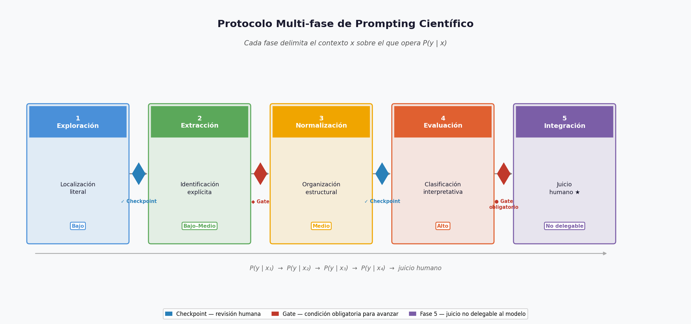

## Antes de comenzar

En el Capítulo 1 comprendiste que un prompt configura un proceso generativo probabilístico. En el Capítulo 2 aprendiste a diseñar prompts con criterio. En el Capítulo 3 aprendiste a construirlos con siete componentes para que sus salidas sean examinables.

Aquí la pregunta vuelve a cambiar:

> ¿Qué pasa cuando el problema científico **no cabe en un solo prompt**?

Muchos errores metodológicos ocurren precisamente ahí: cuando se intenta resolver en un solo acto generativo algo que requiere separar niveles de inferencia. El modelo produce un resultado fluido — y el investigador no puede saber dónde comenzó la especulación [@ji2023].

Este módulo te enseña a diseñar **arquitecturas de interacción**: secuencias de prompts donde cada fase tiene una función epistémica clara, un nivel de inferencia explícito y un punto de control humano antes de avanzar [@wei2022].

## Propósito del capítulo

En este capítulo cambia la unidad de diseño: del **prompt individual** a la **arquitectura de interacción completa**.

Al terminar este capítulo podrás:

1. Distinguir un prompt multi-paso de un protocolo con separación epistémica real.
2. Diseñar un protocolo de cinco fases con función epistémica diferenciada por fase.
3. Aplicar los siete componentes del prompt verificable a cada fase del protocolo.
4. Identificar y documentar gates epistémicos proporcionales al nivel de inferencia.
5. Reconocer el momento de juicio científico no delegable (Fase 5).

::: {.callout-note}
## Material de apoyo

- [**Apéndice A — Formatos de salida**](../apendices/apendice_a.md): plantillas para estructurar salidas en cada fase del protocolo
- [**Del prompt a la respuesta**](../apendices/from-prompt-to-answer.md): flujo técnico completo (tokens → logits → muestreo) que subyace a cada interacción
- [**Glosario**](../apendices/glosario.qmd): términos clave de los tres capítulos
:::

---

## Concepto central — El Prompting como Diseño de Sistema

Un protocolo de prompting científico es una arquitectura que organiza fases diferenciadas de interacción con un sistema generativo probabilístico.

Dado que el modelo opera bajo el esquema P(y|x), todas las operaciones solicitadas en un mismo contexto se resuelven como un único proceso autoregresivo [@brown2020].

Por ello, cuando un problema involucra distintos niveles de inferencia, es necesario:

- Separar fases según función epistémica.
- Controlar las transiciones.
- Introducir verificación proporcional.
- Registrar el proceso para auditoría.


::: {.callout-important}

> El protocolo no cambia el modelo (LLM).
> Cambia el **contexto sobre el cual el modelo opera** y la forma en que el investigador controla su salida.

:::

---

## Del Prompt Individual al Protocolo

Muchos errores metodológicos ocurren cuando se intenta resolver un problema científico complejo con una sola instrucción extensa.

Ejemplo defectuoso:

> “A partir del artículo científico adjunto sobre regulación génica en E. coli, extrae todos los reguladores mencionados, identifica sus promotores asociados, resume la evidencia experimental reportada y evalúa la calidad metodológica del estudio.”

Aquí se mezclan en un único acto generativo:

- **“Extrae todos los reguladores”** → Extracción literal.
- **“sus promotores”** → Organización estructural.
- **“la evidencia experimental”** → Identificación e interpretación de soporte empírico.
- **“evalúa la calidad metodológica”** → Evaluación crítica y juicio metodológico.

Aunque la instrucción esté bien redactada, el modelo la resuelve como **un solo proceso condicionado por el mismo contexto**.

El resultado puede ser fluido y coherente,
pero no separa niveles de inferencia ni distribuye el riesgo.

El protocolo surge precisamente para evitar ese colapso.



::: {.callout-note title="Términos clave — Gate y Checkpoint"}
A lo largo del protocolo se usan dos tipos de punto de control:

**Checkpoint** — Revisión humana de la salida antes de avanzar. No impide el progreso: el investigador evalúa la cobertura o calidad y decide si continúa o repite la fase.

**Gate** — Regla metodológica que *impide avanzar* si no se cumple una condición mínima verificable (por ejemplo: no pasar a Fase 3 si alguna fila de la tabla carece de cita textual). Todo gate incluye un checkpoint, pero no todo checkpoint es un gate.

La diferencia es de grado de obligatoriedad epistémica, no de mecanismo técnico.
:::

### Qué significa “flujo” en un protocolo científico

#### Principio formal

Cada vez que el investigador delimita qué información recibe el modelo, está modificando el contexto \(x\) sobre el cual opera \(P(y \mid x)\).

::: {.callout-important}

> El flujo no modifica el modelo.
> Modifica el **contexto** sobre el cual el modelo opera.

:::

Formalmente:

$$P(y \mid x_1) \;\to\; P(y \mid x_2) \;\to\; P(y \mid x_3)$$

Los fragmentos seleccionados en una fase no “enseñan” nada al modelo. Se convierten en el nuevo contexto operativo para la siguiente fase.

> El investigador no entrena al modelo.
> Delimita el dominio de análisis.

---

#### Qué es — y qué no es — un flujo

En este contexto, *flujo* **no significa** automatización ciega ni encadenamiento mecánico de salidas.

**Significa:**

- Secuencialidad metodológica con función epistémica diferenciada por fase.
- Progresión controlada en el nivel de inferencia.
- Distribución del control epistemológico entre modelo e investigador.
- Trazabilidad acumulativa del proceso.

---

#### Tres modos de flujo

Según cómo se gestiona el contexto entre fases, el flujo puede adoptar tres formas:

**1. Flujo sobre la misma fuente primaria**

Cada fase opera directamente sobre el mismo documento original. Las fases son funcionalmente dependientes, pero el investigador re-consulta la fuente en cada turno sin pasar la salida previa como entrada formal.

- Reduce propagación de error: los errores de una fase no contaminan la entrada de la siguiente.
- Mantiene referencia directa a la fuente original.
- Adecuado para protocolos de bajo volumen o cuando se desconfía de la salida de una fase.

**2. Flujo encadenado (salida → entrada)**

La salida estructurada de una fase se utiliza como contexto de entrada de la siguiente.

- Permite modularidad y reutilización estructurada.
- Habilita automatización parcial en fases de bajo riesgo.

Pero introduce un riesgo adicional:

> Una inferencia incorrecta en una fase temprana puede propagarse y adquirir apariencia de dato consolidado.

Por ello, el encadenamiento solo debe realizarse **después de una verificación proporcional al nivel de inferencia** de cada fase (ver [Gates epistémicos](#ejecución-operativa-de-un-protocolo-chatgpt-vs-apinotebooks)).

**3. Flujo mixto (hibridación)**

En la práctica, la mayoría de los protocolos combinan ambos modos. Las fases de baja inferencia operan sobre la fuente primaria; las fases posteriores encadenan salidas ya validadas.

El caso MalT es un ejemplo de flujo mixto: las Fases 1 y 2 retoman el paper como fuente directa, mientras que las Fases 3 y 4 encadenan tablas validadas producidas en fases anteriores.

---

#### Criterio de decisión

| Situación | Modo recomendado |
|-----------|-----------------|
| Fase de bajo riesgo, primera iteración | Fuente primaria |
| Salida previa verificada y bien estructurada | Encadenado |
| Fase de alta inferencia | Fuente primaria o mixto con gate obligatorio |
| Automatización en producción | Encadenado con gates programáticos |


## Componentes estructurales de un Protocolo de Prompting Científico

Un protocolo no es una colección de prompts, sino una arquitectura metodológica que controla un proceso generativo probabilístico.

Debe incluir:

### 1. Definición explícita del problema científico

La definición del problema científico no es una instrucción al modelo.

Es el antecedente epistemológico del protocolo.

Antes de diseñar cualquier fase, el investigador debe formular con precisión:

- Qué pregunta científica está intentando responder.
- Qué tipo de evidencia sería relevante.
- Qué nivel de inferencia será necesario.
- Qué contará como validación suficiente.

El problema orienta el flujo.
Las tareas orientan al modelo.
El protocolo conecta ambos niveles.

### 2. Descomposición en fases según nivel de inferencia

Cada fase debe cumplir una función epistémica clara:

| Fase | Función epistémica | Nivel de inferencia |
|------|--------------------|---------------------|
| Exploración | Delimitación de dominio | Bajo |
| Extracción | Identificación literal | Bajo |
| Normalización | Organización estructural | Medio |
| Evaluación | Clasificación e interpretación | Alto |
| Integración | Juicio científico | No delegable |

La separación de fases evita que distintos niveles de inferencia colapsen en un único acto generativo.


### 3. Coherencia con los principios del Capítulo 3

Un protocolo multi-etapa no sustituye los principios del prompting científico; los distribuye.

Cada fase debe diseñarse incorporando los siete componentes del prompt verificable:

- **Rol** funcional asignado a la fase.
- **Contexto** operativo delimitado (fuente, alcance del turno, posición en el protocolo).
- **Tarea** con función epistémica específica y acotada.
- **Alcance** explícito (qué debe incluirse en la salida).
- **Restricciones** explícitas (qué no debe afirmarse ni inferirse).
- **Salida esperada** estructurada y evaluable.
- **Verificación** proporcional al nivel de inferencia de la fase.

Principio de proporcionalidad epistemológica:

> El grado de control debe ser proporcional al nivel de inferencia involucrado.

Las fases de alta inferencia requieren mayor estructura, criterios explícitos y revisión humana obligatoria.


### 4. Trazabilidad Epistemológica

Un protocolo científicamente robusto debe poder auditarse.

Para cada fase deben documentarse:

- Prompt utilizado.
- Rol funcional asignado.
- Tipo de operación solicitada.
- Nivel de inferencia permitido.
- Riesgo epistemológico asociado.
- Estrategia de verificación aplicada.

Preguntas que el protocolo debe poder responder:

- ¿Dónde se generó una hipótesis?
- ¿Dónde comenzó la interpretación?
- ¿Dónde se aplicó verificación?
- ¿Qué parte depende del modelo?
- ¿Qué parte depende del juicio humano?

Sin trazabilidad:

- No hay control epistemológico.
- No hay reproducibilidad.
- No hay responsabilidad distribuida.


## Caso aplicado: Regulación del regulón de maltosa (MalT)

### Problema científico

Identificar evidencia experimental que demuestre regulación transcripcional mediada por MalT en *E. coli* y clasificar su robustez metodológica.

El objetivo no es resumir el paper, sino construir una estructura evaluable y auditada de evidencia regulatoria.

::: {.callout-note title="Artículo de trabajo — descarga antes de comenzar"}
**Chapon, C. (1982).** Expression of *malT*, the regulator gene of the maltose region in *Escherichia coli*, is limited both at transcription and translation. *The EMBO Journal*, 1(3), 369–374.

- PMID: [6325162](https://pubmed.ncbi.nlm.nih.gov/6325162/)
- DOI: [10.1002/j.1460-2075.1982.tb01176.x](https://doi.org/10.1002/j.1460-2075.1982.tb01176.x)
- Texto completo gratuito: [PubMed Central — PMC553051](https://pmc.ncbi.nlm.nih.gov/articles/PMC553051/)

Descarga el PDF (o copia el texto completo) antes de aplicar el protocolo. Las cuatro fases requieren acceso al documento íntegro; trabajar con un resumen introduce sesgos de selección que el protocolo busca precisamente evitar.
:::

El protocolo se organiza como un flujo secuencial con control epistemológico distribuido y puntos explícitos de intervención humana.


#### Vista general del protocolo

::: {.callout-tip title="Herramienta de práctica"}
Para diseñar los prompts de cada fase usando los siete componentes de forma guiada, puedes apoyarte en el [**Asistente de Prompting Científico**](https://chatgpt.com/g/g-698031f05448819196530a1612610d8d-asistente-de-prompting-cientifico-modo-docente). Úsalo en las Fases 1–4; recuerda que la **Fase 5 es tuya** — el asistente no puede hacer ese juicio por ti.
:::

| Fase | Función epistémica | Nivel de inferencia | Tipo de operación | Riesgo principal | Gate / Checkpoint | Resultado esperado |
|------|--------------------|---------------------|-------------------|------------------|-------------------|--------------------|
| 1. Exploración | Delimitación de dominio | Bajo | Localización literal de fragmentos | Omisión de evidencia relevante | Checkpoint humano (evaluar cobertura) | Conjunto de fragmentos citados textualmente |
| 2. Extracción | Identificación explícita | Bajo–Medio | Extracción estructurada con cita textual obligatoria | Inferencia implícita no declarada | Gate: no avanzar sin cita textual verificable | Tabla estructurada regulador–gen–evidencia |
| 3. Normalización | Organización estructural | Medio | Estandarización y curación de nombres | Equivalencias sobre-inferidas | Checkpoint contra el paper: nombre original preservado y equivalencia trazable al texto | Tabla normalizada con ambigüedades declaradas |
| 4. Evaluación | Clasificación interpretativa | Alto | Clasificación metodológica con criterio explícito | Juicio interpretativo no justificado | Gate obligatorio + revisión humana explícita | Evidencia clasificada y justificada |
| 5. Integración | Juicio científico | No delegable | Síntesis crítica e interpretación final | Automatización indebida del juicio | Decisión humana final | Conclusión validada con declaración de incertidumbre |


::: {#gate-fase-1-doc .callout-warning title="Gate epistémico esperado — Fase 1"}
En la Fase 1, el modelo tenderá a **resumir y truncar** los fragmentos en lugar de extraerlos íntegramente. Es un problema **predecible**, no un error tuyo. Anticiparlo es una forma de **andamiaje** instruccional [@wood1976; @vygotsky1978].

Tu primer ciclo de ajuste probablemente necesitará abordar esto. Documenta:

- ¿Cómo manifestó el problema en tu caso concreto?
- ¿Qué restricción añadiste para resolverlo?
- ¿Funcionó a la primera? ¿Por qué crees que sí o no?

En el [ejemplo resuelto MalT](#fase-1--exploración-extracto-resuelto) verás este mismo patrón y el ajuste que lo corrigió.
:::

### Fase 1 — Exploración y delimitación de dominio  
**Nivel de inferencia:** Bajo  
**Función epistémica:** Localización sin interpretación  

Datos de entrada:   

- Texto completo del paper científico seleccionado.
- Sin filtros previos.


#### Prompt

```txt {.prompt}
Rol: Explorador de contenido científico.

Contexto:
Texto completo del paper científico seleccionado. Sin filtros previos.

Tarea:
Identifica párrafos del documento que mencionen explícitamente:
- MalT
- Regulación transcripcional
- Promotores
- Experimentos regulatorios
- Ensayos funcionales asociados

Alcance:
- Incluir solo fragmentos donde alguna de las palabras clave aparezca de forma explícita.
- Citar cada fragmento de forma textual y literal (párrafo completo, sin resumir ni truncar).

Restricciones:
- No interpretar resultados.
- No resumir fragmentos.
- No inferir relaciones implícitas entre entidades.

Salida esperada:

| ID | Sección | Fragmento literal | Palabras clave detectadas |

Verificación:
- Revisión humana de cobertura: confirmar que cada fragmento contiene al menos una palabra clave y que la cita es literal e íntegra.
```

Riesgo epistemológico:

- Bajo (posible omisión de fragmentos relevantes).


#### Punto de control humano 1

El investigador:  

- Evalúa si la cobertura es suficiente.  
- Decide si se requiere nueva exploración.  
- Aprueba fragmentos que se convertirán en contexto operativo.  

Principio aplicado:  
Los fragmentos seleccionados se convierten en el nuevo contexto para la Fase 2.  
No hay aprendizaje del modelo; hay delimitación del dominio.  


### Fase 2 — Extracción literal estructurada  

**Nivel de inferencia:** Bajo  
**Función epistémica:** Identificación explícita  

Datos de entrada:   

- Fragmentos aprobados por el investigador en Fase 1.  
- No el paper completo.  
- Contexto delimitado.  


#### Prompt

```txt {.prompt}
Rol: Extractor de información literal.

Contexto:
Fragmentos aprobados por el investigador en Fase 1. No el paper completo.

Tarea:
Extraer únicamente información explícita sobre:
- Regulador
- Gen regulado
- Tipo de evidencia experimental
- Condición experimental
- Resultado reportado

Alcance:
- Incluir únicamente información presente de forma explícita en los fragmentos.
- Cada entrada debe incluir cita textual exacta del fragmento de origen.

Restricciones:
- No inferir relaciones no explícitas.
- No completar información ausente.
- Si no está explícito en la cita, marcar “No especificado”.

Salida esperada:

| Regulador | Gen regulado | Evidencia | Condición | Resultado reportado | Cita textual |

Verificación:
- Confirmación humana de correspondencia entre cada fila y su cita textual.
```

Riesgo epistemológico:

- Bajo a medio (inferencia inadvertida).


#### Punto de control humano 2

El investigador:  

- Elimina entradas sin respaldo textual claro.   
- Marca ambigüedades.   
- Decide si es necesario regresar a Fase 1.

Criterio de transición:  
No avanzar si existen filas sin cita o con inferencia implícita.


### Fase 3 — Normalización y curación    
**Nivel de inferencia:** Medio  
**Función epistémica:** Organización estructural  

Datos de entrada:   

- Tabla estructurada validada en Fase 2.  


#### Prompt

```txt {.prompt}
Rol: Curador bioinformático.

Contexto:
Tabla estructurada validada en Fase 2, con citas textuales verificadas por el investigador.

Tarea:
Estandariza los nombres génicos de la tabla usando nomenclatura oficial, reporta la equivalencia entre el nombre del paper y el nombre canónico, e indica explícitamente cualquier ambigüedad o correspondencia múltiple.

Alcance:
- Conservar todas las columnas de la tabla de Fase 2 en la salida (trazabilidad acumulativa).
- Asignar fuente (base de datos) para cada equivalencia reportada.
- Incluir comentario en casos de ambigüedad o correspondencia múltiple.

Restricciones:
- No eliminar el nombre original del paper.
- No asumir equivalencias no verificables con una base de datos externa.
- No reportar una única correspondencia si existen múltiples posibles.

Salida esperada:

| Regulador | Gen regulado | Evidencia | Condición | Resultado reportado | Cita textual | Nombre estandarizado | Fuente | Ambigüedad (Sí/No) | Comentario |

Verificación:
- Confirmar que el nombre original del paper está preservado en la tabla (columna "Regulador" / "Gen regulado").
- Confirmar que cada equivalencia propuesta puede trazarse al texto del paper — no inferida de una base de datos externa.
- Si se asigna un accession (EcoCyc, UniProt), marcarlo como "VERIFICACIÓN MANUAL REQUERIDA" cuando la entidad no aparece de forma explícita en el paper con ese nombre canónico.
```

La salida **conserva las columnas de Fase 2** y añade las de normalización. Así la tabla puede usarse directamente en Fase 4 sin perder trazabilidad.

::: {.callout-note title="Reflexión — ¿Es correcta esta salida para Fase 4?"}
Antes de avanzar, revisa la tabla que produce Fase 3:

- ¿Conserva las columnas de evidencia de Fase 2 (*Regulador*, *Evidencia*, *Cita textual*)?
- ¿Qué perderías si la salida incluyera **solo** nombres estandarizados, sin el resto de columnas?
- ¿La tabla resultante contiene la información que Fase 4 necesita para clasificar evidencia?

Compara tu respuesta con la salida estructurada del prompt y con lo que pide Fase 4 como *Datos de entrada*.
:::

Riesgo epistemológico:    

- Medio (sobre-inferencia de equivalencias).

Verificación:

- Confirmar que el nombre original del paper está preservado y que cada equivalencia es trazable al texto fuente, no a una inferencia externa.

#### Punto de control humano 3

El investigador:  

- Resuelve ambigüedades.  
- Decide si alguna entrada debe marcarse como incierta.  
- Puede regresar a Fase 2 si detecta error de extracción.


### Fase 4 — Evaluación crítica de evidencia  

**Nivel de inferencia:** Alto  
**Función epistémica:** Clasificación interpretativa  


Datos de entrada:

- Tabla normalizada y curada validada en Fase 3.
- Ambigüedades de nomenclatura resueltas por el investigador en el Punto de control humano 3.
- No el paper completo ni los fragmentos sin procesar.

::: {.callout-note title="Reflexión — ¿Qué entra en Fase 4?"}
Fase 4 no parte del paper ni de los fragmentos de Fase 1. Parte de la **tabla validada** que sale de Fase 3.

Antes de ejecutar el prompt, responde:

- ¿Qué columnas de la tabla de Fase 3 usarás como *Gen* y *Evidencia*?
- ¿Qué ocurre si pasas a Fase 4 una tabla donde aún hay ambigüedades sin resolver?
- ¿Por qué volver al paper completo en esta fase reintroduciría riesgo epistemológico?

Si no puedes trazar cada fila de Fase 4 hasta una cita textual de Fase 2, detente y regresa a Fase 2 o 3.
:::

#### Prompt

```txt {.prompt}
Rol: Revisor metodológico.

Contexto:
Tabla normalizada y curada validada en Fase 3, con ambigüedades de nomenclatura resueltas por el investigador.

Tarea:
Clasificar cada evidencia experimental como:
- Directa
- Indirecta
- Correlacional

Definir criterio operativo explícito para cada categoría antes de clasificar.

Alcance:
- Incluir una definición operativa de cada categoría (máx. 1 línea) al inicio de la salida.
- Trabajar exclusivamente con las filas presentes en la tabla de entrada.

Restricciones:
- No incorporar evidencia nueva del artículo ni de fuentes externas.
- Justificar cada clasificación con la cita textual ya presente en la tabla.
- No asumir robustez metodológica sin evidencia explícita.
- Si una entrada no permite clasificación clara, marcar "No clasificable".
- Declarar limitaciones experimentales si existen.

Salida esperada:

| Gen | Evidencia | Clasificación | Criterio aplicado | Justificación textual | Limitaciones detectadas |

Verificación:
- Revisión humana obligatoria de cada clasificación y su correspondencia con la cita.
- Posible contraste con literatura externa.
```

Riesgo epistemológico:

- Alto (interpretación metodológica).

#### Punto de control humano 4 (Obligatorio)

El investigador:  

- Evalúa consistencia del criterio.  
- Revisa correspondencia entre cita y clasificación.  
- Puede reclasificar evidencia.  
- Puede detener flujo si criterios son débiles.

Criterio de transición:  

- No aceptar clasificación sin revisión explícita.


### Fase 5 — Integración y juicio científico  

**Nivel de inferencia:** No delegable  

::: {#fase-5-juicio-humano .callout-important title="Fase 5 — Juicio científico no delegable"}
La Fase 5 es el único momento del protocolo donde **el modelo no puede decidir por ti** [@king1994].

Puedes pedirle que organice o resuma tablas ya validadas, pero la conclusión final — qué evidencia es más sólida, qué hipótesis queda mejor respaldada, qué sigue siendo incierto — debe ser **tuya** y debe estar justificada con criterio científico propio.

Tu evaluación crítica de esta fase debería responder: *¿En qué me baso para afirmar esto y no otra cosa?*
:::

El investigador integra:

- Consistencia entre extracción y clasificación.
- Robustez global de evidencia.
- Vacíos experimentales.
- Necesidad de validación adicional.

Puede:

- Reabrir fases anteriores.
- Ajustar criterios.
- Reformular hipótesis.

Salida final (producida por el investigador):

- Tabla consolidada de evidencia validada.
- Declaración explícita de incertidumbre.
- Identificación de evidencia fuerte vs provisional.


### Final del protocolo

El modelo genera estructuras condicionadas por el contexto.
El protocolo distribuye y controla el riesgo epistemológico.
El investigador valida, integra y decide qué cuenta como conocimiento provisional.


## Ejemplo resuelto: Regulón MalT en *E. coli*

A continuación se presenta la ejecución completa del protocolo de cinco fases aplicado al artículo de Chapon [-@chapon1982] sobre expresión del gen *malT* ([texto del paper](files/6325162_PMC553051.txt)). Para cada fase se muestra:

1. El prompt ajustado (versión final tras iteración)
2. Un extracto de la salida obtenida del modelo
3. La evaluación crítica de esa salida
4. Los ajustes realizados y su justificación

::: {.callout-note title="Cómo usar este ejemplo"}
Este ejemplo es el **andamio** del ejercicio que sigue [@renkl2014; @chi1989]. No busques replicarlo paso a paso — busca entender la *lógica* de cada ajuste: qué falló, qué restricción lo corrigió y por qué importa antes de avanzar a la siguiente fase.

Contenido adaptado de una entrega documentada del curso (workflow MalT, 2026).
:::

---

### Fase 1 — Exploración (extracto resuelto)

**Prompt ajustado (versión final)**

```txt {.prompt}
Rol: Explorador de contenido científico.

Contexto:
Texto completo del paper [@chapon1982]. Sin filtros previos.

Tarea:
Identifica párrafos del documento que mencionen explícitamente:
- MalT
- Regulación transcripcional
- Promotores
- Experimentos regulatorios
- Ensayos funcionales asociados

Alcance:
- Incluir solo fragmentos donde MalT aparezca de forma explícita.
- Citar el párrafo completo de forma textual, sin resumir ni truncar.

Restricciones:
- No interpretar resultados ni resumir el contenido.
- No inferir relaciones implícitas.
- No explorar ni citar referencias externas.

Salida esperada:

| ID | Sección | Fragmento literal | Palabras clave detectadas |

Verificación:
- Revisión humana de cobertura: confirmar que los fragmentos seleccionados contienen MalT de forma explícita y están citados íntegramente.
```

**Salida del modelo (extracto)**

| ID | Sección | Fragmento literal | Palabras clave detectadas |
|----|---------|-------------------|---------------------------|
| 3 | Introduction | "The maltose regulon of Escherichia coli consists of three operons- malPQ, malEFG, and malK lamB- controlled by a positive regulator gene, malT … Experiments with malT-lacZ fusion strains show that the expression of malT itself is positively controlled by 3'-5'cyclicAMP (cAMP) and its receptor, the catabolite activator protein (CAP) …" | malT, regulation, CAP, cAMP, promoter |
| 9 | Results | "From this experiment we concluded that malTpl is located 12 nucleotides upstream from the transcription start,i.e.,in the Pribnow box … of the malT promoter,while malTp7 is located in a transcribed region and may therefore affect translation initiation." | malT, promoter, Pribnow box, transcription |
| 10 | Results | "The double mutant was constructed … The resulting strain produced ~30 times more β-galactosidase than the control strain …" | malT, mutant, β-galactosidase |

**Evaluación crítica**

En la primera ejecución (prompt del capítulo sin restricciones adicionales), el modelo produjo ~30 filas pero **resumió** fragmentos con puntos suspensivos y **incluyó** filas donde MalT no era el foco explícito (p. ej. ensayos genéricos de SDS-PAGE). La estructura era correcta; la fidelidad literal no.

**Ajuste y justificación**

Se añadieron dos restricciones: (1) solo fragmentos donde MalT esté explícitamente mencionado; (2) párrafo completo, sin resumir. Tras el ajuste, la tabla pasó de ~30 a ~15 filas verificables — menos volumen, mayor trazabilidad. **Gate humano 1:** el investigador aprueba el subset de fragmentos que alimentará Fase 2.

---

### Fase 2 — Extracción literal (extracto resuelto)

**Prompt ajustado (versión final)**

```txt {.prompt}
Rol: Extractor de información biológica de alta precisión.

Contexto:
Fragmentos aprobados por el investigador en Fase 1 (extracto del paper [@chapon1982]). No el paper completo.

Tarea:
Extraer únicamente información explícita sobre:
- Regulador
- Gen regulado
- Tipo de evidencia experimental
- Condición experimental
- Resultado reportado

Alcance:
- Cada entrada debe incluir cita textual exacta del fragmento de origen.
- En "Regulador": solo proteínas, complejos o ligandos (MalT, CAP, cAMP). Las mutaciones (malTp1, malTp7…) van en "Condición experimental".
- Revisar la cita textual completa antes de marcar "No especificado".

Restricciones:
- No inferir relaciones no explícitas.
- No completar información ausente.
- Si no está explícito en la cita, marcar "No especificado".

Salida esperada:

| Regulador | Gen regulado | Evidencia | Condición | Resultado reportado | Cita textual |

Verificación:
- Eliminación de filas sin cita verificable; marcado de ambigüedades antes de Fase 3.
```

**Salida del modelo (extracto)**

| Regulador | Gen regulado | Evidencia | Condición | Resultado reportado | Cita textual |
|-----------|--------------|-----------|-----------|---------------------|--------------|
| CAP, cAMP | malT | malT-lacZ fusion strains | presencia/ausencia de CAP y cAMP | expresión positivamente controlada | "Experiments with malT-lacZ fusion strains show that the expression of malT itself is positively controlled by … CAP …" |
| MalT | malPQ, malEFG, malK-lamB | No especificado | No especificado | controlados por regulador positivo malT | "…three operons … controlled by a positive regulator gene, malT" |
| — | malT-lacZ | doble mutante malTp1 malTp7 | mutaciones cis al híbrido | ~30× más β-galactosidasa | "The resulting strain produced ~30 times more β-galactosidase than the control strain …" |

**Evaluación crítica**

La primera ejecución clasificó **mutaciones como reguladores** (malTp1, malTp7 en columna "Regulador") y marcó "No explícito" en campos donde la cita sí contenía la información. Error de **precisión biológica**, no de formato.

**Ajuste y justificación**

Restricción explícita: regulador = entidad biológica activa (proteína/ligando), no alelo mutante. Obligación de revisar la cita antes de "No especificado". **Gate humano 2:** eliminar filas sin cita verificable; marcar ambigüedades antes de Fase 3.

---

### Fase 3 — Normalización (extracto resuelto)

**Prompt ajustado (versión final)**

```txt {.prompt}
Rol: Curador bioinformático de alta precisión.

Contexto:
Tabla de Fase 2 validada por el investigador. Contexto: paper [@chapon1982], entidades del regulón malT.

Tarea:
Estandariza los nombres génicos de la tabla usando nomenclatura oficial; diferencia gen (malT), proteína (MalT) y ligando (cAMP); reporta la equivalencia con el nombre del paper; asigna identificador único cuando sea posible (EcoCyc, UniProtKB, ChEBI); e indica explícitamente cualquier ambigüedad.

Alcance:
- Conservar todas las columnas de Fase 2 en la salida (trazabilidad acumulativa).
- Incluir la fuente de cada equivalencia reportada.
- Comentar todos los casos de ambigüedad o correspondencia múltiple.

Restricciones:
- No eliminar el nombre original del paper.
- No asumir equivalencias no verificables con una base de datos externa.
- Si no hay identificador con certeza: "VERIFICACIÓN MANUAL REQUERIDA".

Salida esperada:

| Regulador | Gen regulado | Evidencia | Condición | Resultado | Cita textual | Nombre estandarizado | Tipo | Accession | Fuente | Ambigüedad | Comentario |

Verificación:
- Confirmar que el nombre original del paper está preservado y que cada equivalencia es trazable al texto fuente.
- Los accessions (EcoCyc, UniProt) son auxiliares; si la entidad no aparece con ese nombre en el paper, marcar "VERIFICACIÓN MANUAL REQUERIDA".
```

**Salida del modelo (extracto)**

| Regulador | Gen regulado | … | Nombre estandarizado | Tipo | Fuente | Ambigüedad |
|-----------|--------------|---|----------------------|------|--------|------------|
| CAP, cAMP | malT | … | *malT* | gen | EcoCyc: EG10599 | No | — |
| CAP | malT | … | CRP (≡ CAP) | proteína | UniProt: P0ACJ8 | No | sinónimo histórico |
| MalT | malK-lamB | … | *malK*, *lamB* | gen | EcoCyc | Sí | "malK lamB" sin guión en el paper |

**Evaluación crítica**

La primera ejecución estandarizó nombres pero dejó **"No explícito"** en todas las fuentes y **perdió** las columnas de evidencia de Fase 2 — tabla inutilizable para Fase 4.

**Ajuste y justificación**

Obligar fuentes de bases de datos y **conservar columnas de Fase 2**. **Gate humano 3:** resolver ambigüedad malK-lamB manualmente; confirmar que cada equivalencia es trazable al paper antes de avanzar a Fase 4 — si el accession no puede verificarse en el texto fuente, declararlo como pendiente de confirmación.

---

### Fase 4 — Evaluación crítica (extracto resuelto)

**Prompt ajustado (versión final)**

```txt {.prompt}
Rol: Revisor metodológico.

Contexto:
Tabla normalizada de Fase 3, con ambigüedades de nomenclatura resueltas por el investigador.

Tarea:
Clasificar cada evidencia como Directa, Indirecta o Correlacional.
Definir criterio operativo (máx. 1 línea por categoría) antes de clasificar.

Alcance:
- Incluir definición operativa de cada categoría al inicio de la salida.
- Mantener exactamente el mismo gen y evidencia de la tabla de entrada.

Restricciones:
- Trabajar exclusivamente con las filas de la tabla de Fase 3; no incorporar evidencia nueva del artículo.
- Justificación derivada de la cita original, sin parafraseo.
- Si no permite clasificación clara: "No clasificable".

Salida esperada:

| Gen | Evidencia | Clasificación | Criterio aplicado | Justificación textual | Limitaciones detectadas |

Verificación:
- Revisión humana obligatoria: evaluar consistencia del criterio y correspondencia entre clasificación y cita.
```

**Salida del modelo (extracto)**

| Gen | Evidencia | Clasificación | Criterio aplicado | Limitaciones detectadas |
|-----|-----------|---------------|-------------------|-------------------------|
| malT | malT-lacZ fusion strains | Indirecta | reportero como proxy de expresión | no mide mRNA ni proteína MalT directamente |
| malT | reverse transcriptase mapping | Directa | mide inicio de transcripción | posible banda secundaria por degradación |
| malT-lacZ | ~30× β-galactosidasa | Indirecta | actividad enzimática de reportero | no cuantifica MalT |

**Evaluación crítica**

Primera ejecución: criterios bien definidos, pero el modelo **añadió filas** con evidencia no presente en la tabla de entrada (p. ej. lacY, SDS-PAGE) — pérdida de trazabilidad.

**Ajuste y justificación**

Restricción estricta: solo filas de la tabla de Fase 3; opción "No clasificable". **Gate humano 4 (obligatorio):** revisar cada clasificación contra la cita; reclasificar si el criterio no se aplicó de forma consistente.

---

### Fase 5 — Integración y juicio científico (investigador)

Esta fase **no se delega al modelo**. El investigador integra las tablas validadas y produce la conclusión.

**Entrada:** tablas aprobadas de Fases 1–4 + notas de los cuatro puntos de control humano.

**Síntesis del investigador (extracto)**

> La evidencia más sólida para regulación transcripcional de *malT* proviene del mapeo del inicio de transcripción (reverse transcriptase mapping) y de la localización de malTp1 en la caja de Pribnow — clasificada como evidencia **directa**. La dependencia de CAP-cAMP se sustenta principalmente en fusiones malT-lacZ — evidencia **indirecta** pero convergente. La mutación malTp7 afecta traducción (sitio Shine-Dalgarno); no debe interpretarse como evidencia transcripcional.
>
> **Incertidumbre declarada:** el efecto sobre operones downstream (malPQ, malEFG, malK-lamB) se infiere del rol de MalT como regulador positivo, pero el paper no cuantifica regulación directa gen por gen en esta lectura.
>
> **Evidencia fuerte:** malTp1 → aumento de iniciación transcripcional (directa + indirecta convergente).
> **Evidencia provisional:** extensión del regulón completo más allá de *malT* auto-regulado.

**Evaluación del proceso (meta-reflexión)**

El mayor salto de calidad ocurrió en Fase 1 (de resumen a extracción literal) y en Fase 2 (separar regulador de mutación). Sin esos ajustes, Fases 3–4 habrían organizado y clasificado **errores biológicos** con apariencia de rigor.

---

### Lecciones del ejemplo resuelto

| Fase | Falla predecible del modelo | Restricción que la corrige |
|------|----------------------------|---------------------------|
| 1 | Resume y trunca fragmentos | Párrafo completo + solo MalT explícito |
| 2 | Mutaciones como "regulador" | Definición biológica de regulador |
| 3 | Pierde columnas de Fase 2 | Salida acumulativa con trazabilidad |
| 4 | Añade evidencia externa | Solo tabla de entrada |
| 5 | Conclusión automática | Juicio humano no delegable |

::: {.callout-tip title="Antes de tu propio artículo"}
Recorre la tabla de lecciones con tu paper: ¿en qué fase anticipas el primer gate? La sección siguiente describe cómo documentar la ejecución en tu artículo.
:::

## Tu proyecto: ejecutar y ajustar el workflow

Este bloque corresponde al **entregable principal** del curso: aplicar el protocolo de cinco fases a un **artículo científico de tu elección**, no al caso MalT ni al ejercicio RNA-seq del final del capítulo.

### Qué debes hacer

1. **Declarar el problema científico** en una frase operativa (qué evidencia buscas estructurar y evaluar — no “resumir el paper”).
2. **Ejecutar las cinco fases** con prompts adaptados a tu dominio (regulación génica, interacción proteína–proteína, vías de señalización, etc.).
3. **Evaluar críticamente** cada salida del modelo antes de usarla como entrada de la fase siguiente.
4. **Ajustar prompts** cuando aparezcan fallas predecibles; documentar versión inicial, problema observado, restricción añadida y resultado.
5. **Integrar en Fase 5** con juicio humano (ver callout de Fase 5 arriba).

### Regla de encadenamiento

```
Salida validada de la Fase N  →  contexto de entrada de la Fase N+1
```

Cada transición implica un **checkpoint** humano; en fases de bajo riesgo puede bastar revisión de cobertura; en fases altas, un **gate** que impide avanzar si falta trazabilidad (cita textual, fila verificable, etc.). Recuerda del Capítulo 1: en un solo bloque de contexto \(x\), el modelo resuelve todo como **un único acto autoregresivo** — por eso separas fases y acotas \(x\) en cada turno.

### Adaptar el protocolo MalT a tu artículo

El caso MalT usa entidades *regulador–gen–evidencia experimental*. Si tu paper no es de regulación transcripcional, **no copies los prompts literalmente**: conserva la **función epistémica** de cada fase y redefine entidades y subpreguntas.

Ejemplo (artículo de interacción proteína–proteína): subpreguntas como existencia de la interacción, dependencia de condiciones moleculares, efecto de mutaciones, consecuencias funcionales y rescate fenotípico — cada una con su Fase 1 (localización) y Fase 2 (extracción literal) antes de normalizar y clasificar.

### Qué documentar en la entrega

| Elemento | Detalle |
|----------|---------|
| Metadatos | Artículo (cita), **producto y versión** del modelo, chat web o API/notebook |
| Por fase | Prompt (inicial y ajustado), salida, evaluación crítica, decisión de gate |
| Fase 5 | Síntesis **redactada por ti** con incertidumbre declarada |
| Reflexión | Tres preguntas (ver abajo) |

::: {.callout-warning title="Recuerda — Fase 1 en tu artículo"}
El gate de resumen/truncamiento de fragmentos aparece en **casi todas** las entregas. Anticipa restricciones de extracción literal *antes* de gastar iteraciones en fases posteriores. Consulta el [gate documentado de Fase 1](#gate-fase-1-doc) y el [ejemplo MalT](#fase-1--exploración-extracto-resuelto).
:::

::: {.callout-important title="Recuerda — Fase 5 en tu artículo"}
No delegues la conclusión integradora al modelo. Puedes usarlo para tabular, pero **tú** decides qué evidencia es fuerte, provisional o insuficiente. Ver [Fase 5 — Juicio científico no delegable](#fase-5-juicio-humano).
:::

### Reflexión final (plantilla para la entrega)

Responde por escrito (5–10 líneas cada una):

1. ¿Qué tipo de problemas aparecieron con **mayor frecuencia** en las respuestas del modelo?
2. ¿Qué **ajustes en los prompts** fueron más efectivos?
3. ¿Qué aprendiste sobre el diseño de prompts científicos en un workflow multi-fase?

### Ejecución operativa de un protocolo (ChatGPT vs API/Notebooks)

Un protocolo multi-etapa no es solo un diagrama: debe ejecutarse de forma que preserve los **puntos de control** y la **verificación proporcional**.

La regla central es:

::: {.callout-important}

> La separación de fases debe reflejarse en la ejecución.  
> Si todo se pega en un solo bloque, vuelve a colapsar en un único proceso generativo.

:::

#### A) Ejecución en un chat (p. ej., ChatGPT)

**Recomendado: fase por fase.**

1. **Enviar Fase 1** (exploración / delimitación).
2. **Revisar** cobertura y pertinencia (Punto de control humano 1).
3. Con los fragmentos aprobados, **enviar Fase 2** usando esos fragmentos como contexto operativo.
4. Repetir (Fase 3, 4…), validando en cada transición.

Por qué no conviene “pegar todo el flujo completo”:

- Aunque esté escrito como “Paso 1, Paso 2…”, el modelo lo resuelve como **un solo acto autoregresivo**.
- Se pierde el control en transiciones y la verificación intermedia se vuelve nominal.

**Práctica sugerida:**  

- Copiar y pegar la salida estructurada de cada fase (tablas) en un documento de trabajo (Markdown/CSV).  
- Reingresar al chat solo lo necesario para la fase siguiente.  
- Registrar prompts + salidas para trazabilidad.  

---

#### B) Ejecución en notebooks (semi-automatizado con control humano)

En un Jupyter notebook, el flujo puede ser **asistido** sin volverse automático:

- Cada fase corre en una celda.
- La salida se guarda en una variable (tabla).
- El investigador revisa antes de ejecutar la siguiente celda.
- Se guardan artefactos (CSV/JSON) para reproducibilidad.

Ejemplo conceptual de flujo:

1. Celda 1: pegar texto del paper (o fragmentos) y correr **Fase 1**.
2. Celda 2: revisar lista de fragmentos; seleccionar subset.
3. Celda 3: correr **Fase 2** sobre fragmentos seleccionados; producir tabla.
4. Celda 4: correr **Fase 3** (normalización) sobre tabla.
5. Celda 5: correr **Fase 4** (evaluación) con criterios explícitos.
6. Celda 6: integración humana (síntesis final, decisiones, incertidumbre).

Ventaja metodológica:

- Se preserva “output → input” con **puntos de control** explícitos (el investigador decide cuándo avanzar).


<a href="files/Prompting_Cientifico_Caso_MalT.ipynb" download class="btn btn-primary">
⬇ Descargar notebook editable
</a>

#### C) Ejecución con API (automatización responsable)

En API, sí puede existir un “pipeline”, pero **no debe ser ciego**.

Principio:

> Automatizar fases de bajo riesgo es razonable;  
> automatizar fases de alto riesgo requiere validaciones, umbrales y gates.

Patrón recomendado (“gated pipeline”):

1. Ejecutar Fase 1.
2. Aplicar un *gate* (ver definición al final de esta sección):
   - Si la cobertura es baja o hay ambigüedad, detener y pedir revisión humana.
3. Ejecutar Fase 2 con fragmentos aprobados.
4. Validar: cada fila debe tener cita textual; si no, marcar para revisión.
5. Ejecutar Fase 3 y validar normalización con fuente externa.
6. Ejecutar Fase 4 y **obligar** a revisión humana antes de aceptar clasificación.

En otras palabras:

- La API puede encadenar pasos,
- pero el protocolo sigue exigiendo **puntos de decisión humanos** donde aumenta la inferencia.


::: {.callout-note title="Definición operativa — Checkpoint y Gate" collapse="true"}
**Checkpoint** → Punto de revisión humana.

**Gate** → Regla metodológica que impide avanzar si no se cumple una condición mínima verificable.

Todo gate implica un checkpoint, pero no todo checkpoint es un gate.

- Revisar estilo de redacción → checkpoint.
- No avanzar si falta cita textual → gate.

Un gate no es un mecanismo técnico; es una decisión epistémica formalizada.
:::


### Regla didáctica 

- En chat: **siempre fase por fase**.
- En notebooks: **semi-automatizado con checkpoints**.
- En API: **automatización con gates** (validación + detención ante riesgo).


## Ejercicio

::: {.callout-tip title="Antes de comenzar"}
Este ejercicio de **aula** (rediseño del protocolo RNA-seq) es **complementario** al [proyecto de workflow en tu artículo](#tu-proyecto-ejecutar-y-ajustar-el-workflow). Aquí diagnosticas arquitectura; en el proyecto ejecutas las cinco fases con documentación de ajustes.

Se evalúa con la **Rúbrica del Capítulo 4** (seis dimensiones: Diagnóstico, Niveles de inferencia, Arquitectura, Gates epistémicos, Riesgo epistemológico, Juicio humano). Revísala antes de diseñar tu rediseño.
:::

::: {.exercise-box}

### Escenario

Un equipo de investigación desea utilizar IA para analizar resultados de RNA-seq y propone el siguiente protocolo/prompt:


### Prompt propuesto por el equipo de investigación

```txt {.prompt}
Rol: Asistente experto en análisis transcriptómico y biología molecular.

Contexto:
Se dispone de una tabla de expresión diferencial derivada de un experimento de RNA-seq comparando condición control vs tratamiento.

Tarea:

Paso 1 — Identificación de genes relevantes  
Analiza la tabla de expresión diferencial y selecciona los genes que cumplan:
- |log2FoldChange| > 1
- p-valor ajustado < 0.05  

Ordena los genes por magnitud de cambio y reporta los 20 más significativos.

Paso 2 — Análisis funcional  
Con base en la lista obtenida en el Paso 1:
- Identifica vías metabólicas significativamente afectadas.
- Determina procesos biológicos enriquecidos.
- Resume los patrones funcionales principales.

Paso 3 — Evaluación estadística  
Evalúa la solidez estadística del análisis considerando:
- Tamaño de muestra.
- Corrección por múltiples pruebas.
- Magnitud del efecto.
- Posible presencia de sesgos experimentales.

Paso 4 — Generación de hipótesis mecanísticas  
Integra los resultados anteriores y propone hipótesis biológicas que expliquen el mecanismo molecular subyacente al tratamiento.

Salida esperada:
- Lista estructurada de genes relevantes.
- Tabla de vías afectadas.
- Evaluación metodológica.
- Conclusión integradora con hipótesis biológicas.

```

El equipo planea ejecutar esta instrucción como un solo prompt.

Analiza si realmente constituye un protocolo metodológicamente robusto o si sigue siendo un único acto generativo con riesgo epistemológico acumulativo.


### Parte A — Diagnóstico crítico

1. Identifica al menos cinco fallas metodológicas del protocolo.  
2. Clasifica cada falla según:  
   - Mezcla de niveles de inferencia.  
   - Ausencia de delimitación de dominio.  
   - Falta de salida estructurada evaluable.  
   - Ausencia de verificación.  
   - Delegación implícita de juicio científico.  
3. Explica cómo cada falla puede generar conclusiones plausibles pero no validadas.


### Parte B — Rediseño arquitectónico

Rediseña el protocolo bajo los siguientes criterios:

- Separación de fases según nivel de inferencia.  
- Inclusión explícita de restricciones.  
- Salidas estructuradas.  
- Al menos tres gates epistémicos.  
- Definición clara de intervención humana.  

Debe incluir:

1. Definición precisa del problema.  
2. Esquema de flujo.  
3. Descripción breve de cada fase.  
4. Justificación metodológica.  


### Parte C — Análisis de riesgo

Responde:

- ¿En qué momento el protocolo pasa de análisis estadístico a interpretación biológica?  
- ¿Cuál es el mayor punto de riesgo epistemológico?  
- ¿Qué tipo de error se propagaría si no se incluyeran gates?  


:::

## Rúbrica

Este ejercicio se evalúa con la [Rúbrica del Capítulo 4](./rubrica_capitulo4.html). Las seis dimensiones son:

1. **Diagnóstico** — identificación de fallas arquitectónicas (20 %)
2. **Niveles de inferencia** — separación extracción, análisis, evaluación e hipótesis (15 %)
3. **Arquitectura** — diseño multi-etapa con progresión metodológica (25 %)
4. **Gates epistémicos** — puntos de detención y revisión humana (15 %)
5. **Riesgo epistemológico** — declaración de riesgo por fase (15 %)
6. **Juicio humano** — momento no delegable de la conclusión (10 %)

Consulta la rúbrica completa antes de entregar tu rediseño del protocolo RNA-seq.


## Checkpoint — antes de tu proyecto o cierre del módulo

::: {.callout-tip title="Autoevaluación formativa (~5 min)"}
Responde por escrito **sin consultar el texto**.

1. ¿Cuál es la diferencia entre un **checkpoint** y un **gate** en un protocolo de prompting? Da un ejemplo de cada uno en el caso MalT.
2. ¿Por qué pegar las cinco fases en un solo mensaje al chatbot **anula** la arquitectura del protocolo? Relaciónalo con \(P(y \mid x)\) del Capítulo 1.
3. En la **Fase 5**, ¿qué decisiones deben ser tuyas aunque uses el modelo para organizar tablas? ¿Qué pregunta deberías poder responder al final?

Si fallaste la pregunta 2, repasa [Ejecución operativa](#ejecución-operativa-de-un-protocolo-chatgpt-vs-apinotebooks) antes de iniciar [tu proyecto](#tu-proyecto-ejecutar-y-ajustar-el-workflow).
:::

::: {#guia-discusion-post-entrega .callout-note title="Guía docente — Sesión post-entrega (~30 min)"}
**Objetivo:** que los estudiantes vean, por contraste, qué distingue un workflow con ajuste superficial de uno con arquitectura y trazabilidad [@schwartz1998].

1. Presenta (sin identificar autores) **dos protocolos contrastantes** de entregas reales: uno con ajuste mayormente en Fase 1; otro con gates documentados, trazabilidad entre fases y reflexión epistémica en Fase 5.
2. **Pregunta guía:** *¿Qué diferencia hace el nivel de restricción que pusiste en tu prompt de Fase 2?*
3. **Para discutir en grupo:** ¿Qué haría falta para que el protocolo más simple alcance el nivel del más riguroso?
4. **Cierre:** conecta los hallazgos con la [rúbrica del Capítulo 4](./rubrica_capitulo4.html) — especialmente Arquitectura, Gates epistémicos y Juicio humano.
:::

## Conclusión

En el Capítulo 1 aprendimos que un prompt configura un proceso generativo probabilístico.

En el Capítulo 3 comprendimos que el control epistemológico depende de:

- Restricciones explícitas.
- Salidas estructuradas.
- Verificación.
- Declaración del nivel de inferencia.

En este capítulo dimos un paso adicional:

> El problema científico no se resuelve con un prompt mejor redactado,
> sino con una arquitectura metodológica explícita.

### 1. La estructura textual no garantiza rigor

Dividir una instrucción en pasos no equivale a separar niveles de inferencia.

Un prompt multistep puede seguir siendo:

- Un único acto generativo.
- Un colapso inferencial.
- Una automatización con riesgo acumulativo.

La separación epistémica no es textual.
Es arquitectónica.

### 2. El flujo no es automatización

Un flujo en prompting científico implica:

- Secuencialidad controlada.
- Delimitación progresiva del contexto.
- Distribución del riesgo.
- Puntos de transición explícitos.

No implica ejecutar todo de una vez.

Formalmente:

El protocolo no modifica el modelo.
Modifica el contexto sobre el cual el modelo opera.

P(y | x₁) → P(y | x₂) → P(y | x₃)

Cada transición debe estar justificada.


### 3. Gates como reglas epistémicas

Un gate no es una herramienta técnica.

Es una decisión metodológica:

> No avanzar si no se cumple una condición mínima de validez.

Sin gates, el flujo es automático.
Con gates, el flujo es científico.


### 4. Proporcionalidad inferencial

No todas las fases requieren el mismo nivel de control.

- Extracción → bajo riesgo.
- Normalización → riesgo medio.
- Evaluación → alto riesgo.
- Hipótesis → no delegable.

El control debe aumentar con la inferencia.


### 5. El rol irreductible del investigador

El modelo:

- Genera estructuras plausibles.
- Organiza información.
- Explicita patrones.

Pero no:

- Asume responsabilidad metodológica.
- Valida experimentalmente.
- Decide qué cuenta como conocimiento.

El juicio científico no se automatiza.
Se estructura.

---

Si el Capítulo 3 trataba del control interno del prompt,
y el Capítulo 4 del diseño de arquitecturas de interacción,

el siguiente nivel implica preguntarse:

¿Cómo integrar estos protocolos en flujos de trabajo científicos reales,
con datos, herramientas externas y criterios formales de validación?

Ese será el siguiente paso.

## Referencias

::: {#refs}
:::

::: {.chapter-nav}

::: {.chapter-nav-item .chapter-nav-prev}
::: {.chapter-nav-label}
Anterior
:::
::: {.chapter-nav-title}
Anatomía del Prompt Científico
:::
:::

:::
